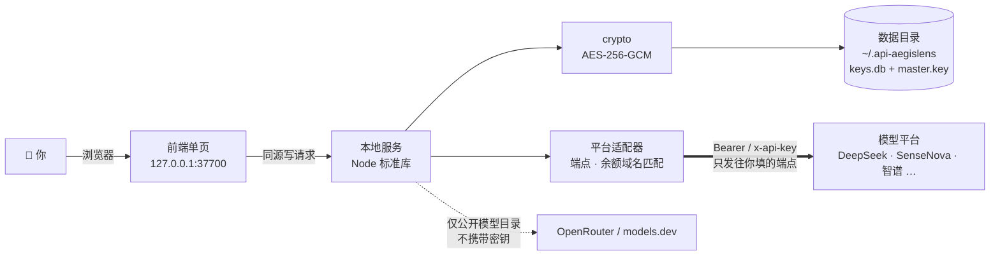

<div align="center">

# 🛡️ API-AegisLens

**本地优先的 AI API Key 管理工具** —— 一次录入，全盘掌握，随处可用。


[简体中文](./README.md) ｜ [English](./README_EN.md) ｜ [部署指南](./DEPLOYMENT.md) ｜ [安全模型](./SECURITY.md) ｜ [产品设计文档](./api-aegislens-prd/api-aegislens-prd.html)（实现之前的设计稿，含未落地项，页首有差异声明）

</div>

> [!NOTE]
> 把散落各处的 AI 平台 API Key 收拢到本机统一管理：字段级加密存储、连通性测试、模型目录自动拉取、
> 一键生成 Dify / n8n / Claude Code / `.env` 配置片段。全程只监听 `127.0.0.1`，
> 密钥只发往**你自己填写的那个端点**；联网补全只拉取公开模型目录，不携带任何密钥。

---

## ⚡ 30 秒跑起来

```bash
git clone https://github.com/YYY-HUB-SYS/API-AegisLens.git
cd API-AegisLens/app
npm start
```

浏览器打开 <http://127.0.0.1:37700>。Windows 也可以直接双击 `app/start.bat`。
**零依赖** —— 纯 Node.js 标准库，`git clone` 之后不需要 `npm install`。

| 环境 | 会用到哪个存储 | 说明 |
|---|---|---|
| Node.js **≥ 22** | SQLite（`keys.db`） | 推荐；`node:sqlite` 自 22 起提供 |
| Node.js 18 – 21 | JSON 文件（`store.json`） | 功能完全一致，静默回退 |

> [!WARNING]
> 两个后端之间**不会自动迁移数据**。先用 18–21 录过、再升到 22 的话列表会是空的 ——
> 数据没丢，还在 `store.json` 里。启动时如果检测到另一份库，日志会打一行
> `⚠ 数据目录里还有另一份密钥库 …`，看到它请先确认再动手，**别删文件**。

---

## 🧭 日常工作流

```
新增密钥 → 测试连通 → 拉取模型 → 生成配置 → 记录去向
```

1. **新增密钥** —— 选平台（13 个内置 + 自定义），贴上 Key，地址与默认模型自动填好；名称留空则自动取密钥**末 4 位**
2. **测试连通** —— 调平台模型列表接口验真；没有列表接口的端点自动改走对话接口做鉴权探测。每条地址都能单独点「测」，徽章会写明是**第几条端点**通的
3. **拉取模型** —— 平台自报的上下文/最大输出**优先采用**，缺哪项才交给内置元数据库 → 联网检索 → 手动补充
4. **生成配置** —— Dify / n8n / Claude Code / `.env` 四种模板，自动带入模型参数与认证说明
5. **记录去向** —— 这把 Key 配到了哪些工具，卡片上一目了然

---

## 📦 能力一览

| | 能力 | 一句话说明 |
|---|---|---|
| 🔐 | 加密存储 | 仅密钥字段 AES-256-GCM 加密落盘，其余字段明文；可设解锁口令，用 scrypt 派生密钥封装主密钥 |
| 🗝️ | 凭证保险库 | 网站账号密码、两步验证密钥（TOTP 实时出码）、API 密钥与备注，同样字段级加密；带口令生成器与复用/弱口令体检 |
| 🎟️ | 消费者作用域令牌 | 给服务端程序各发一把窄权限、会过期、可单独吊销的 Bearer 令牌，替掉「二十个进程共用一把万能钥匙」；见[作用域令牌](#-机器消费者作用域令牌) |
| 🧪 | 连通性测试 | 按端点验证，延迟与失败原因都落到卡片上 |
| 🧺 | 账号池 | 把多把 Key 归成一个池子，统一看成员的状态 / 余额 / 有效期；池成员照样只出末 4 位，锁定状态下同样 `423` |
| 🛰 | 模型目录 | 自动拉取 + 四级兜底，火山方舟 Agent Plan 内置官方目录 |
| 🔌 | 多兼容端点 | 一把 Key 最多 6 个 Base URL（OpenAI / Anthropic / 自定义模式） |
| ⚙️ | 配置生成 | Dify / n8n / Claude Code / `.env`，端点风格不符会明确警告 |
| 💰 | 余额监控 | 按端点**域名**匹配官方接口，自定义平台指向官方域名同样可查 |
| ⏳ | 有效期管理 | 临期（30 天内）/ 过期自动判定并在看板标色 |
| 🌐 | 代理自动检测 | 直连不通的境外中转站自动走系统 / 环境变量代理（CONNECT 隧道） |
|  | 特殊认证 | 平台预置认证说明（如小红书 Dots 的 `api-key` 头），可逐条覆盖 |
| 🧩 | 零依赖 | 纯标准库，不用 `npm install`；前端是单文件页面，不引任何 CDN。唯一随仓的二进制是本地 vendor 的等宽字体子集（OFL 授权，见 `app/public/vendor/fonts/CREDITS.md`） |

---

## 🗺 数据往哪儿走



> [!IMPORTANT]
> **威胁模型：这台机器上的其他进程不在防御范围内。**
> 服务默认只绑 `127.0.0.1`，接口列表**只回密钥末 4 位**，明文必须走单条 `POST /api/keys/:id/reveal`
> （受会话与限流约束并记审计）。但**默认安装是免密的**：没设解锁口令时，以你的身份运行的
> 任意本机进程照样能逐条取到明文。设了口令之后，未解锁状态下密钥、凭证、账号池三类接口一律返回 `423`。
> 要给服务端程序用，别让它来蹭这把万能钥匙——给每个消费者签一把[作用域令牌](#-机器消费者作用域令牌)。
> 一旦用 nginx 等反代暴露到局域网或公网，任何能访问那个地址的人都能拿到这些数据 ——
> 远程使用请走 SSH 隧道（详见[部署指南](./DEPLOYMENT.md#局域网与远程访问)）。
> 完整的信任边界清单——包括每一条防线成立的前提，以及**明列防不住的东西**——见[安全模型](./SECURITY.md)。

---

## 🔑 机器消费者：作用域令牌

如果你有若干个服务端程序要用这些密钥（CLI、Agent 框架、内部服务），别让它们共用你的解锁口令，也别让它们去爬 `GET /api/keys`。给每个消费者签一把**窄权限、会过期、可单独吊销**的令牌：

| scope | 放开的那条路 | 拿到什么 |
|---|---|---|
| `key:read` | `GET /api/consumer/keys/:id` | 该条密钥的明文 |
| `key:test` | `POST /api/consumer/keys/:id/test` | 连通性测试结果（**不含**明文） |
| `balance:read` | `GET /api/consumer/keys/:id/balance` | 余额快照（不触发刷新） |
| `cred:read` | `GET /api/consumer/credentials/:id` | 该条凭证的明文口令 / TOTP 种子 |

每个 scope 还要配一份**资源白名单**（哪些 key id、哪些 credential id）。白名单是枚举不是通配：空清单等于「一条都读不到」，想给全部就得显式列全。这样吊销某条密钥之后，忘记重签的令牌不会自动继续覆盖它。

签发在界面上做（令牌串**只在创建那一刻显示一次**，之后库里只剩 HMAC 指纹，日志与审计里也只有指纹）。命令行同理：

```bash
curl -s -X POST http://127.0.0.1:37700/api/consumer/tokens \
  -H 'Content-Type: application/json' \
  -d '{"label":"my-agent","scopes":["key:read"],"keyIds":[3],"ttlSeconds":2592000}'

curl -s http://127.0.0.1:37700/api/consumer/keys/3 \
  -H 'Authorization: Bearer v1.xxxxx.yyyyy'
```

三条边界最好先知道，否则会在生产里踩到：

- **改口令不吊销任何令牌。** 设口令、改口令、拆除 `master.key` 都不换 DEK 本体（只是把它重新包一层），
  而令牌的有效性只跟 DEK 绑定——这条是端到端实测出来的，不是推理的。要下线一把令牌请用界面上的「吊销」。
- **设了口令的安装重启后，消费者先拿到 `423`。** 没有 DEK 时服务端连「这令牌是不是我签的」都答不了，
  所以报的是「服务端锁着」而不是「你的令牌坏了」。要么人解锁一次，要么非交互场景用 `AKM_PASSPHRASE`（代价见部署指南）。
- **拒绝是分型的**：`missing` / `malformed` / `bad-signature` / `expired` / `revoked` / `unknown` 一律 401，
  作用域不足 403，未解锁 423。其中 `unknown`（签名对但库里查不到这个 tid）就是重建过库或换了数据目录的样子。

---

## 🔌 端点风格 × 目标工具

生成配置时会按工具挑**风格匹配**的端点；不匹配时不静默凑合，而是在模板里写明警告。

| 目标工具 | 需要哪种端点 | 生成什么 | 没有匹配端点时 |
|---|---|---|---|
| Dify | OpenAI 兼容 | 模型供应商配置片段 | 用第一条地址并提示"可能连不通" |
| n8n | OpenAI 兼容 | Chat Model 节点参数 | 同上 |
| Claude Code | **Anthropic 兼容** | `ANTHROPIC_BASE_URL` / `ANTHROPIC_AUTH_TOKEN` | 用第一条地址并警告需 `/v1/messages` |
| `.env` | OpenAI 兼容 | `AI_API_KEY` / `AI_BASE_URL` / `AI_MODEL` 等 | 同上 |

连通性测试与模型拉取默认走**第一条**端点，也可以在某条地址上单独点「测」或「模型」。

---

## 🧪 测试

```bash
cd app
npm test
```

覆盖加密、保险库会话与限流、恢复信封、存储（双后端 + 影子库检测）、凭证路由、消费者作用域令牌
（签发 / 验签 / 吊销 / 四条数据路由的门禁顺序）、TOTP 与口令生成、API 集成与校验、平台适配器（目录 / 余额域名 / 特殊认证）、
代理与启动脚本、前端模板与弹层行为。
项数随代码演进变化，**以实跑输出为准**：本版本于 2026-10-09 在 Node v24.14.0 实跑 `tests 492 / pass 492 / fail 0`。

---

## 🗂 目录结构

```
├── app/                      # 主应用（Node.js，零依赖）
│   ├── server.js             # 启动入口
│   ├── src/                  # 加密 / 存储 / API / 平台适配器 / 模型兜底
│   ├── public/               # 前端单页
│   └── test/                 # 测试
├── api-aegislens-prd/        # 产品设计文档（实现之前写的 v0.9，含未落地项，页首有差异声明；可直接浏览器打开）
├── demo/                     # 交互演示页（纯前端假数据，无后端）
├── index.html                # 项目主页
├── SECURITY.md               # 威胁模型：防谁、不防谁、每条防线的前提
└── DEPLOYMENT.md             # 部署 · 备份 · 升级
```

---

## ⚖️ 已知限制

我们宁可把它写在这儿，也不让它变成你踩到时的"惊喜"。

- **免密安装下本机进程仍能逐条取明文** —— 没设解锁口令时接口闸门一直是开着的；列表已改成只出末 4 位，但 `reveal` 不需要凭据。真正收紧要设口令
- **默认仍把 DEK 与数据同目录** —— 设口令只是给它加了一层封装。要做到「拷走整个目录也解不开」，得在「凭证保险库 → 明文密钥」里执行一次拆除（不可逆，且服务端必须先用工令实际解一次验证成功才允许删）。没设口令时这个按钮根本不出现，因为此时删掉 `master.key` 等于毁库
- **机器消费者不能「开机即用」** —— 设了口令之后，重启后必须有人解锁（或在非交互场景配 `AKM_PASSPHRASE`），在此之前带有效令牌的请求也一律 `423`。这不是漏改：能自动解锁的凭据必然以明文躺在本机某处，而那正是这套设计要避免的东西。解锁之后不存在「每 5 分钟把消费者踢下线」的悬崖——每一记通过的令牌请求都算一次真实使用，会把闲置计时续上；真的没人用了才会锁
- **免口令安装里签发接口同样对本机进程敞开** —— 给它单独一档限流，审计只记 HMAC 指纹，但免口令时它和 `reveal` 一样不需要凭据。收紧的办法就是设口令
- **令牌不是网关** —— 拿到 `key:read` 的消费者仍然取得明文密钥、自己去打厂商。要做「程序不接触明文也能用模型」，那是中转网关的活，本工具目前没有
- **忘记口令只能靠恢复码** —— 恢复码在设置口令时一次性显示、永不落盘。两张都没了就是永久解不开，没有后门
- **不支持 KeePass（KDBX）导入** —— KDBX4 要完整实现变体 KDF 与 HMAC 块保护，超出零依赖范围；凭证也**没有**从其它密码管理器导入的通道，只认本工具自己的导出格式
- **导出的 JSON 默认不含明文密钥** —— 要含明文必须显式勾选「包含明文密钥（风险自担）」，勾上才会逐条取；日常备份建议直接复制数据目录
- **余额接口只覆盖三家** —— DeepSeek / Moonshot·Kimi / 智谱。硅基流动的 `/v1/user/info` 已于 2026-08-14 官方下线（410），因此不在列表内
- **自定义兼容模式不可自动测** —— 端点风格名不是 `openai` / `anthropic` 时，连通测试与模型拉取会明确要求手动处理
- **联网补全是"猜"** —— 同名模型在不同提供方的上限并不相同，所以平台自报值优先；仍靠联网得到的数值，卡片上会标 `web`
- **导入文件的 `type` 只在前端校验** —— 界面会拒掉非本工具的导出文件，但 `POST /api/import` 只认 `keys` 数组。这不是漏改：前端本来就不转发 `type`，后端加必填校验会当场打死应用自己的导入功能；而"仅在 `type` 存在时校验"又挡不住任何省略该字段的请求，等于假装有校验。要真正闭合得前后端一起改
- **自动上锁之前不会提醒** —— 无操作满 5 分钟（`AKM_IDLE_LOCK_MINUTES` 可改）保险库自己锁上，界面上没有任何倒计时或临近提示，正在填的表单会直接撞 `423`。门上原本挂着一个「X 分 Y 秒后会自动上锁」的倒计时，它是死代码：读的是 `idleRemainingMs`，而这一位在**已锁定**时恒为 `0`，门只在锁着的时候出现，所以一次都没显示过，已删。想要剩多少，程序可以问 `GET /api/vault/status`；给人看的进度条是新功能，得跟着解锁态的闲置时钟走
- **`index.html` 启动时读入内存** —— 改前端文件需要重启服务才生效

---

## 🙏 许可与致谢

本项目以 **MIT** 许可发布，见 [LICENSE](./LICENSE)。

**原始设计与实现来自 [roseion/ai-key-manager](https://github.com/roseion/ai-key-manager) 的作者 Reinhard**
（个人主页 <https://www.oldgao.com> · QQ 638694 · 微信 reincat）：字段级加密存储、平台适配器、
模型目录拉取、一键配置生成这套骨架是他的。`LICENSE` 中他的版权行按 MIT 的要求原样保留。

在此之上由 **YYY-HUB-SYS** 完成的这份版本，改动量是可以量的。口径写清楚以便复现：
对 `git ls-files app/src app/public index.html` 列出的 36 个文件逐个跑
`git blame --line-porcelain`，按 `author` 行计数。下面这组数字是**截至 `c298881`** 的快照
（钉在提交上，不然它和它想说明的事实会各自漂移）——共 17,073 行：

| 作者 | 行数 | 占比 |
|---|---|---|
| YYY-HUB-SYS（本版本） | 12,568 | 73.6% |
| Reinhard（原始版本） | 4,505 | 26.4% |

其中 24 个文件一行都不来自上游，但**这 24 个不是一回事**，混在一起说会夸大本版本的工作量：

- **12 个 JS + 2 个 CSS** 是本版本写的：`vault.js`、`recovery.js`、`credentials-api.js`、
  `consumer-tokens.js`、`consumer-api.js`、`totp.js`、`passgen.js`、`scheduler.js`、
  `daemon.js`、`model-shape.js`，两个前端视图 `credentials-view.*`、`consumer-view.*`
- **2 枚 SVG** 是自绘的项目标识（盾牌 + 光阑）
- **2 份 JSON**（`password-rules.json`、`change-password-URLs.json`）和 **1 个字体文件**
  是从**别的**上游取来的第三方材料，不是我们写的，见下方许可证一节
- **5 份** 是随仓的许可证与说明文件（`CREDITS.md`、`OFL.txt`、`LICENSE-ISC.txt` 等）
  —— 它们同样是第三方文本，本版本只是把它们放到该在的位置

本版本新增或重写的部分：解锁口令信封与恢复码、闲置自动锁、限流与脱敏审计、六族明文出口收口、
账号密码保险库、TOTP 与口令生成器、消费者作用域令牌、定时调度、后台化与「非回环监听必须先有口令」这条不变量、
[安全模型](./SECURITY.md)，以及中英两份文档按实测结果逐条订正。

第三方随仓材料（Lucide 图标 ISC + 部分 Feather MIT、JetBrains Mono OFL、Apple
`password-manager-resources` MIT）的许可证与来源核验记录，见
[SECURITY.md 的供应链一节](./SECURITY.md#供应链与遥测)。
