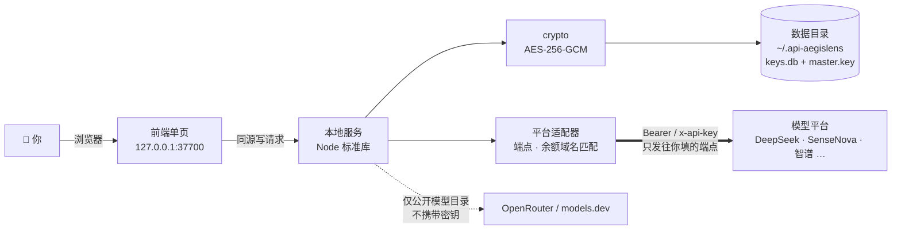

<div align="center">

# 🛡️ API-AegisLens

**本地优先的 AI API Key 管理工具** —— 一次录入，全盘掌握，随处可用。


[简体中文](./README.md) ｜ [English](./README_EN.md) ｜ [部署指南](./DEPLOYMENT.md) ｜ [产品设计文档](./api-aegislens-prd/api-aegislens-prd.html)

</div>

> [!NOTE]
> 把散落各处的 AI 平台 API Key 收拢到本机统一管理：字段级加密存储、连通性测试、模型目录自动拉取、
> 一键生成 Dify / n8n / Claude Code / `.env` 配置片段。全程只监听 `127.0.0.1`，
> 密钥只发往**你自己填写的那个端点**；联网补全只拉取公开模型目录，不携带任何密钥。

---

## ⚡ 30 秒跑起来

```bash
git clone https://github.com/YYY-HUB-SYS/API-AegisLens.git
cd API-AegisLens/app
npm start
```

浏览器打开 <http://127.0.0.1:37700>。Windows 也可以直接双击 `app/start.bat`。
**零依赖** —— 纯 Node.js 标准库，`git clone` 之后不需要 `npm install`。

| 环境 | 会用到哪个存储 | 说明 |
|---|---|---|
| Node.js **≥ 22** | SQLite（`keys.db`） | 推荐；`node:sqlite` 自 22 起提供 |
| Node.js 18 – 21 | JSON 文件（`store.json`） | 功能完全一致，静默回退 |

> [!WARNING]
> 两个后端之间**不会自动迁移数据**。先用 18–21 录过、再升到 22 的话列表会是空的 ——
> 数据没丢，还在 `store.json` 里。启动时如果检测到另一份库，日志会打一行
> `⚠ 数据目录里还有另一份密钥库 …`，看到它请先确认再动手，**别删文件**。

---

## 🧭 日常工作流

```
新增密钥 → 测试连通 → 拉取模型 → 生成配置 → 记录去向
```

1. **新增密钥** —— 选平台（13 个内置 + 自定义），贴上 Key，地址与默认模型自动填好；名称留空则自动取密钥**末 4 位**
2. **测试连通** —— 调平台模型列表接口验真；没有列表接口的端点自动改走对话接口做鉴权探测。每条地址都能单独点「测」，徽章会写明是**第几条端点**通的
3. **拉取模型** —— 平台自报的上下文/最大输出**优先采用**，缺哪项才交给内置元数据库 → 联网检索 → 手动补充
4. **生成配置** —— Dify / n8n / Claude Code / `.env` 四种模板，自动带入模型参数与认证说明
5. **记录去向** —— 这把 Key 配到了哪些工具，卡片上一目了然

---

## 📦 能力一览

| | 能力 | 一句话说明 |
|---|---|---|
| 🔐 | 加密存储 | 仅密钥字段 AES-256-GCM 加密落盘，其余字段明文；主密钥与数据同目录 |
| 🧪 | 连通性测试 | 按端点验证，延迟与失败原因都落到卡片上 |
| 🛰 | 模型目录 | 自动拉取 + 四级兜底，火山方舟 Agent Plan 内置官方目录 |
| 🔌 | 多兼容端点 | 一把 Key 最多 6 个 Base URL（OpenAI / Anthropic / 自定义模式） |
| ⚙️ | 配置生成 | Dify / n8n / Claude Code / `.env`，端点风格不符会明确警告 |
| 💰 | 余额监控 | 按端点**域名**匹配官方接口，自定义平台指向官方域名同样可查 |
| ⏳ | 有效期管理 | 临期（30 天内）/ 过期自动判定并在看板标色 |
| 🌐 | 代理自动检测 | 直连不通的境外中转站自动走系统 / 环境变量代理（CONNECT 隧道） |
|  | 特殊认证 | 平台预置认证说明（如小红书 Dots 的 `api-key` 头），可逐条覆盖 |
| 🧩 | 零依赖 | 纯标准库；前端是单文件页面，不引任何 CDN 或外部字体 |

---

## 🗺 数据往哪儿走



> [!IMPORTANT]
> **这个应用没有任何登录鉴权** —— 它被设计成只在你自己的电脑上跑。
> 服务只绑 `127.0.0.1`、写接口校验 Origin 同源，但**本机任意进程都能读到解密后的密钥**。
> 一旦用 nginx 等反代暴露到局域网或公网，任何能访问那个地址的人都能看到你的全部密钥明文。
> 远程使用请走 SSH 隧道（详见[部署指南](./DEPLOYMENT.md#远程访问)）。

---

## 🔌 端点风格 × 目标工具

生成配置时会按工具挑**风格匹配**的端点；不匹配时不静默凑合，而是在模板里写明警告。

| 目标工具 | 需要哪种端点 | 生成什么 | 没有匹配端点时 |
|---|---|---|---|
| Dify | OpenAI 兼容 | 模型供应商配置片段 | 用第一条地址并提示"可能连不通" |
| n8n | OpenAI 兼容 | Chat Model 节点参数 | 同上 |
| Claude Code | **Anthropic 兼容** | `ANTHROPIC_BASE_URL` / `ANTHROPIC_AUTH_TOKEN` | 用第一条地址并警告需 `/v1/messages` |
| `.env` | OpenAI 兼容 | `AI_API_KEY` / `AI_BASE_URL` / `AI_MODEL` 等 | 同上 |

连通性测试与模型拉取默认走**第一条**端点，也可以在某条地址上单独点「测」或「模型」。

---

## 🧪 测试

```bash
cd app
npm test
```

覆盖加密、存储（双后端 + 影子库检测）、API 集成与校验、平台适配器（目录 / 余额域名 / 特殊认证）、
代理与启动脚本、前端模板与弹层行为。项数随代码演进变化，**以实跑输出为准**：
本 fork 于 2026-10-07 在 Node v24.14.0 实跑 `tests 133 / pass 133 / fail 0`。

---

## 🗂 目录结构

```
├── app/                      # 主应用（Node.js，零依赖）
│   ├── server.js             # 启动入口
│   ├── src/                  # 加密 / 存储 / API / 平台适配器 / 模型兜底
│   ├── public/               # 前端单页
│   └── test/                 # 测试
├── api-aegislens-prd/        # 产品设计文档（可直接浏览器打开）
├── demo/                     # 交互演示页（纯前端假数据，无后端）
├── index.html                # 项目主页
└── DEPLOYMENT.md             # 部署 · 备份 · 升级
```

---

## ⚖️ 已知限制

我们宁可把它写在这儿，也不让它变成你踩到时的"惊喜"。

- **主密钥与数据同目录** —— 拿到 `~/.api-aegislens` 整个目录就等于拿到明文密钥。备份请按同等敏感级别处理
- **导出的 JSON 是明文** —— 导出文件内含未加密的 Key，用完即删；日常备份建议直接复制数据目录
- **余额接口只覆盖三家** —— DeepSeek / Moonshot·Kimi / 智谱。硅基流动的 `/v1/user/info` 已于 2026-08-14 官方下线（410），因此不在列表内
- **自定义兼容模式不可自动测** —— 端点风格名不是 `openai` / `anthropic` 时，连通测试与模型拉取会明确要求手动处理
- **联网补全是"猜"** —— 同名模型在不同提供方的上限并不相同，所以平台自报值优先；仍靠联网得到的数值，卡片上会标 `web`
- **`index.html` 启动时读入内存** —— 改前端文件需要重启服务才生效

---

## 🙏 许可与致谢

本项目以 **MIT** 许可发布，见 [LICENSE](./LICENSE)。

这是 [roseion/ai-key-manager](https://github.com/roseion/ai-key-manager) 的维护分支（fork），
原始设计与实现归功于原作者 **Reinhard**：个人主页 <https://www.oldgao.com> · QQ 638694 · 微信 reincat。
本分支在其之上完成了更名、数据目录搬迁、加密边界与文档一致性等一系列修正。
