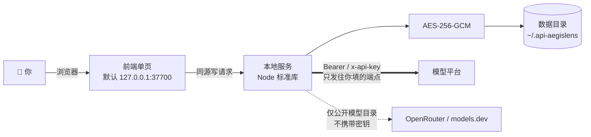

<div align="center">

# 🛡️ API-AegisLens

**本地优先的 AI API Key 保险柜。** 散在各家平台、各个 `.env`、各个浏览器标签里的密钥和网站口令，收到本机一个目录：字段级加密、一键测连通、自动拉模型参数、生成 Dify / n8n / Claude Code / `.env` 片段，再用窄权限令牌交给你的脚本。


[English](./README_EN.md) ｜ [部署指南](./DEPLOYMENT.md) ｜ [安全模型](./SECURITY.md) ｜ [接口与限制一览](./docs/API.md) ｜ [产品设计文档](./api-aegislens-prd/api-aegislens-prd.html)（实现之前的设计稿，含未落地项，页首有差异声明）

</div>


*看板长这样（浅色是默认主题）。图里四把 Key 是隔离演示库中的假密钥（`sk-demo-*`）。还没决定装不装？用浏览器直接打开 [`demo/index.html`](./demo/index.html) —— 界面是真的、数据是假的，不装 Node、不碰磁盘。*

---

## 60 秒跑起来

```bash
git clone https://github.com/YYY-HUB-SYS/API-AegisLens.git
cd API-AegisLens/app
npm start
```

纯 Node.js 标准库，`git clone` 之后**不需要 `npm install`**；Windows 也可以双击 `app/start.bat`。终端会打出这个（2026-10-09 在 Node v24 上的实录 —— 那一次我用 `AKM_DATA_DIR` 指到了临时目录，你不动环境变量时它默认是 `~/.api-aegislens`）：

```text
  API-AegisLens v0.1.0 已启动
  浏览器访问: http://127.0.0.1:37700
  数据目录: C:\Users\<你>\AppData\Local\Temp\aegis-firstboot
  存储后端: sqlite（密钥字段 AES-256-GCM 加密）
  保险库状态: 免密（未设解锁口令；设了之后重启即要求解锁）
  定时调度: 关闭（AKM_SCHEDULE_ENABLED=1 或 POST /api/schedule {"enabled":true} 开启）
  停止服务: 前台按 Ctrl+C；后台（--daemon）用 node server.js --stop
```

然后浏览器打开 <http://127.0.0.1:37700>，贴一把 Key 进去就能测连通、拉模型、生成配置。

**第一次跑会撞上的坑，写在起跑线上**：

- Node **≥ 22** 走 SQLite（`keys.db`），18–21 静默回退 JSON（`store.json`）。功能完全一致，但**两边互不迁移**：换过 Node 版本后列表空了别慌，数据还在 `store.json` 里。启动时检测到另一份库会打一行 `⚠ 数据目录里还有另一份密钥库`，看到它**先确认再动手，别删文件**
- Node 22 起 `node:sqlite` 仍标着实验特性，那行 `ExperimentalWarning` 是 Node 打的，不是这里出错；另外改 `app/public/` 下的前端文件要**重启服务**才生效 —— `index.html` 是启动时读进内存的

## 适合谁

- 手上同时管着 DeepSeek / Kimi / 智谱 / Claude / 火山方舟 … 十几把 Key，现在靠备忘录和散落的 `.env` 文件的人
- 要把密钥喂给本机脚本、Agent 框架、内部服务的人 —— 给每个消费者签一把会过期、可单独吊销的窄权限令牌，而不是大家蹭同一个万能口令
- 网站口令、API 私钥、两步验证种子也想收到一起，且不想交给任何云端的
- 一个人多台机器、各自一份的（数据目录可以整体拷走）

## 不适合什么

- **多人共用的密钥中台** —— 没有账号体系，一机一份
- **「程序不接触明文也能调模型」** —— 那是中转网关的活，本工具不做；拿到 `key:read` 的消费者仍然取得明文自己去打厂商
- **把这台机器当不可信环境** —— 威胁模型明确不防同机进程，见[安全模型](./SECURITY.md#防不住的东西明说)
- **当密码管理器使** —— 凭证保险库管的是「本机要用的口令和 TOTP」，不支持 KeePass（KDBX）导入，也没有从别的密码管理器迁移的通道

## 它都有什么

十句话，每句都能在界面上点到：

- **字段级加密** // 密钥、网站口令、私钥、TOTP 种子、备注各自一条 AES-256-GCM 密文；列表接口只回末 4 位，明文必须走单条 `reveal`
- **解锁口令 + 52 位恢复码** // scrypt(N=32768, r=8, p=1) 派生 KEK 包住 DEK；口令不写进本机任何文件，恢复码只在设置那一刻显示一次
- **闲置自动锁** // 默认 5 分钟没有真实读写就上锁（`AKM_IDLE_LOCK_MINUTES`），页面轮询的那几条只读接口不算「使用」
- **连通性测试** // 有 `/models` 的走列表，没有的改走对话接口做鉴权探测；每条地址都能单独测，徽章写明是**第几条端点**通的
- **模型参数四级兜底** // 平台自报优先 → 内置元数据库 → 联网检索公开目录 → 手动补；按字段记来源，你改过的重新拉取不会被覆盖
- **一键配置片段** // Dify / n8n / Claude Code / `.env` 四种模板；端点风格和目标工具预期不符时明确警告，不静默给你一份错配置
- **凭证保险库** // 网站口令 / API 私钥 / 动态码出码，明文只驻内存 30 秒，切走标签页立即收回
- **账号池** // 多把 Key 归成一组看成员健康，成员走的还是同一套掩码视图，锁着照样 `423`
- **作用域令牌** // 4 个 scope + 资源清单 + 有效期 + 单独吊销；库里只留 HMAC 指纹前 8 位
- **零依赖** // 纯标准库、前端单文件、不引 CDN；唯一随仓的二进制是本地 vendor 的等宽字体子集（OFL）

逐项能力、对应接口、字段上限和所有限制数字，在[接口与限制一览](./docs/API.md)。那里每条路径和每个数字都是从代码里数出来的，并由 `app/test/docs.test.js` 对着源码复核 —— 写了代码里不存在的接口，它就红。


*凭证保险库解锁之后：口令默认掩码，动态码当场出码（环形进度跟着服务端 `step` 走），明文 30 秒自动收回、切走标签页立即收回。*

---

## 给脚本发一把窄权限钥匙（实跑往返）

命令都是真跑的，密钥来自隔离目录里的假数据（`sk-demo-*`）。签一把「只能读 key 3、30 天过期」的令牌：

```bash
curl -s -X POST http://127.0.0.1:37700/api/consumer/tokens \
  -H 'Content-Type: application/json' \
  -d '{"label":"my-agent","scopes":["key:read"],"keyIds":[3],"ttlSeconds":2592000}'
```

返回 17 个键，其中 `token` 的明文**只在这一次出现**（227 字符，`v1.` 开头），库里只留 HMAC 指纹：

```json
{"token":"v1.eyJ0aWQiOiI…","fingerprint":"c39499dc","label":"my-agent",
 "scopes":["key:read"],"keyIds":[3],"resourceCount":1,"expiresAt":"2026-11-08T14:24:28.000Z"}
```

拿着它读清单里那条 → 200，读清单外那条 → 403，不带它 → 401：

```bash
curl -s http://127.0.0.1:37700/api/consumer/keys/3 -H "Authorization: Bearer $TOKEN"
# 200 {"id":3,"name":"Claude 订阅","platform":"anthropic","key":"sk-demo-anthropic-0003"}
curl -s http://127.0.0.1:37700/api/consumer/keys/1 -H "Authorization: Bearer $TOKEN"
# 403 {"error":"令牌的作用域不覆盖这个资源","reason":"scope"}
curl -s http://127.0.0.1:37700/api/consumer/keys/3
# 401 {"error":"缺少 Authorization: Bearer <token>","reason":"missing"}
```

三条边界最好先知道，否则会在生产里踩到：

- **改口令不吊销任何令牌** —— 设口令、改口令、拆除 `master.key` 都不换 DEK 本体（只是重新包一层），而令牌的有效性只跟 DEK 绑定。这条是端到端实测的，不是推理的。要下线一把令牌请用界面上的「吊销」
- **设了口令的安装重启后，消费者先拿到 `423`** —— 没有 DEK 时服务端连「这令牌是不是我签的」都答不了，所以报的是「服务端锁着」而不是「你的令牌坏了」。要么人解锁一次，要么非交互场景配 `AKM_PASSPHRASE`（代价见部署指南）
- **资源清单是枚举不是通配** —— 空清单等于「一条都读不到」，想给全部就得显式列全

---

## 数据往哪儿走



> [!IMPORTANT]
> **威胁模型：这台机器上的其他进程不在防御范围内。**
> 服务默认只绑 `127.0.0.1`，列表接口只回末 4 位，明文必须走单条 `reveal`（受会话与限流约束并记审计）。
> 但**默认安装是免密的**：没设口令时，以你的身份运行的任意本机进程照样能逐条取到明文；设了口令之后，未解锁状态下密钥、凭证、账号池三类接口一律 `423`。
> 一旦用 nginx 等反代暴露到局域网或公网，任何能访问那个地址的人都能拿到这些数据 —— 远程使用请走 SSH / WireGuard 隧道（详见[部署指南](./DEPLOYMENT.md#局域网与远程访问)）。
> 完整的信任边界清单，包括每条防线成立的前提和**明列防不住的东西**，见[安全模型](./SECURITY.md)。

## 已知限制

写在这儿，是为了不让你踩到时当成「惊喜」。

- 免密安装下本机进程仍能逐条取明文：`reveal` 和令牌签发都不需要凭据（后者有单独一档限流，审计只记指纹）—— 真正收紧要设口令
- 默认仍把 DEK 与数据同目录；要做到「拷走整个目录也解不开」，得手动执行一次拆除明文主密钥（**不可逆**，且服务端必须先用口令实际解一次才算数）
- 机器消费者不能「开机即用」：设了口令之后，重启后必须有人解锁，在此之前带有效令牌的请求也一律 `423`
- 令牌不是网关，本工具不做中转；忘记口令只能靠那 52 位恢复码，两张都没了就是永久解不开，没有后门
- 导出的 JSON 默认**连 `key` 字段都不带**；要含明文必须显式勾选并逐条取。日常备份建议直接复制数据目录
- 不支持 KeePass（KDBX）导入（KDBX4 要完整实现变体 KDF 与 HMAC 块保护，超出零依赖范围）；余额查询只覆盖 DeepSeek / Moonshot·Kimi / 智谱三家（硅基流动的 `/v1/user/info` 已于 2026-08-14 官方下线）
- 端点风格不是 `openai` / `anthropic` 时不自动测，会要求手动处理；联网补全也是「猜」——同名模型在不同提供方上限不同，所以平台自报值优先，仍靠联网得到的会标 `web`
- 导入文件的 `type` 只在前端校验，`POST /api/import` 只认 `keys` 数组（要闭合得前后端一起改，见部署指南的说明）
- 自动上锁之前不会提醒：界面上没有倒计时。门上原本挂着一个倒计时，那是死代码 —— 它读的 `idleRemainingMs` 在**已锁定**时恒为 `0`，而门只在锁着时出现，所以一次都没显示过，已删
- 三块能力只有接口、界面上没入口：观测历史（每把 Key 存最近 1000 条）、定时调度开关、`/api/meta` 详情。列出来是为了**不把接口当功能吹**

---

## 开发

```bash
cd app && npm test        # 等价于 node --test test/*.test.js
```

2026-10-09 在 Node v24.14.0 实跑：`tests 497 / pass 497 / fail 0`，项数随代码演进变化，**以实跑为准**。覆盖：加密、保险库会话与限流、恢复信封、双存储后端与影子库检测、凭证路由、消费者令牌的签发 / 验签 / 吊销 / 四条数据路由的门禁顺序、TOTP 与口令生成、API 集成与校验、平台适配器、代理与启动脚本、前端模板与弹层行为，以及一组盯着**文档和代码是否一致**的 `docs.test.js`。

## 报告安全问题 / 备份

请不要开公开 issue —— 按 [SECURITY.md 的「报告安全问题」](./SECURITY.md#报告安全问题)走私密渠道。
备份很简单：数据目录就那几个文件（`keys.db` + `master.key`，设了口令后还有 `vault.key` / `recovery.env`），**整目录复制就是备份**；恢复码显示过一次之后不在任何文件里，抄在纸上。换机器、开机自启、后台运行、代理配置见[部署指南](./DEPLOYMENT.md)。

## 许可与致谢

本项目以 **MIT** 许可发布，见 [LICENSE](./LICENSE)。**原始设计与实现来自 [roseion/ai-key-manager](https://github.com/roseion/ai-key-manager) 的作者 Reinhard**（个人主页 <https://www.oldgao.com> · QQ 638694 · 微信 reincat）：字段级加密存储、平台适配器、模型目录拉取、一键配置生成这套骨架是他的，`LICENSE` 里他的版权行按 MIT 的要求原样保留。

在此之上由 **YYY-HUB-SYS** 完成的这份版本，改动量是可以量的。口径：对 `git ls-files app/src app/public index.html` 列出的 36 个文件逐个跑 `git blame --line-porcelain`、按 `author` 行计数；这组数字是**截至 `c298881`** 的快照（共 17,073 行）——本版本 12,568 行（73.6%），上游 4,505 行（26.4%）。其中 12 个 JS + 2 个 CSS 是本版本新写的模块（`vault.js`、`recovery.js`、`credentials-api.js`、`consumer-tokens.js`、`consumer-api.js`、`totp.js`、`passgen.js`、`scheduler.js`、`daemon.js`、`model-shape.js` 和两个前端视图），另有 2 份 JSON 和 1 个字体文件是**别的**上游的第三方材料，不是我们写的。

本版本新增或重写的：解锁口令信封与恢复码、闲置自动锁、限流与脱敏审计、六族明文出口收口、账号密码保险库、TOTP 与口令生成器、消费者作用域令牌、定时调度、后台化与「非回环监听必须先有口令」这条不变量、[安全模型](./SECURITY.md)，以及中英两份文档按实测结果逐条订正。第三方随仓材料（Lucide ISC + 部分 Feather MIT、JetBrains Mono OFL、Apple `password-manager-resources` MIT）的许可证与来源核验记录，见[供应链一节](./SECURITY.md#供应链与遥测)。
