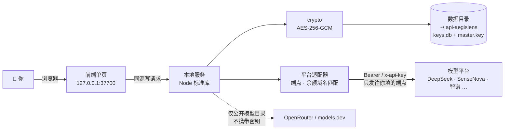

<div align="center">

# 🛡️ API-AegisLens

**本地优先的 AI API Key 管理工具** —— 一次录入，全盘掌握，随处可用。


[简体中文](./README.md) ｜ [English](./README_EN.md) ｜ [部署指南](./DEPLOYMENT.md) ｜ [安全模型](./SECURITY.md) ｜ [产品设计文档](./api-aegislens-prd/api-aegislens-prd.html)（实现之前的设计稿，含未落地项，页首有差异声明）

</div>

> [!NOTE]
> 把散落各处的 AI 平台 API Key 收拢到本机统一管理：字段级加密存储、连通性测试、模型目录自动拉取、
> 一键生成 Dify / n8n / Claude Code / `.env` 配置片段。默认只监听 `127.0.0.1`，
> 密钥只发往**你自己填写的那个端点**；联网补全只拉取公开模型目录，不携带任何密钥。

---

## ⚡ 30 秒跑起来

```bash
git clone https://github.com/YYY-HUB-SYS/API-AegisLens.git
cd API-AegisLens/app
npm start
```

浏览器打开 <http://127.0.0.1:37700>。Windows 也可以直接双击 `app/start.bat`。
**零依赖** —— 纯 Node.js 标准库，`git clone` 之后不需要 `npm install`。

| 环境 | 会用到哪个存储 | 说明 |
|---|---|---|
| Node.js **≥ 22** | SQLite（`keys.db`） | 推荐；`node:sqlite` 自 22 起提供 |
| Node.js 18 – 21 | JSON 文件（`store.json`） | 功能完全一致，静默回退 |

> [!WARNING]
> 两个后端之间**不会自动迁移数据**。先用 18–21 录过、再升到 22 的话列表会是空的 ——
> 数据没丢，还在 `store.json` 里。启动时如果检测到另一份库，日志会打一行
> `⚠ 数据目录里还有另一份密钥库 …`，看到它请先确认再动手，**别删文件**。

---

## 🧭 日常工作流

```
新增密钥 → 测试连通 → 拉取模型 → 生成配置 → 记录去向
```

1. **新增密钥** —— 选平台（13 个内置 + 自定义），贴上 Key，地址与默认模型自动填好；名称留空则自动取密钥**末 4 位**
2. **测试连通** —— 调平台模型列表接口验真；没有列表接口的端点自动改走对话接口做鉴权探测。每条地址都能单独点「测」，徽章会写明是**第几条端点**通的
3. **拉取模型** —— 平台自报的上下文/最大输出**优先采用**，缺哪项才交给内置元数据库 → 联网检索 → 手动补充
4. **生成配置** —— Dify / n8n / Claude Code / `.env` 四种模板，自动带入模型参数与认证说明
5. **记录去向** —— 这把 Key 配到了哪些工具，卡片上一目了然

上面这条主线之外，界面还有三块各自独立的面板：**凭证保险库**（网站口令 / API 私钥 / TOTP）、
**账号池**（多把 Key 归成一组看成员健康）、**消费者令牌**（给本机脚本发窄权限钥匙）。
逐项能力与对应接口见[功能地图](#-功能地图)。

---

## 🧩 功能地图

下面每一行都能指到**界面上的入口**和**背后的接口**，两边都是从这个仓里数出来的（截至
`646afc7`：`app/src/api.js` + `credentials-api.js` + `consumer-api.js` 共 **47 条路由**
——按「方法 + 路径」组合数，去重后是 **38 条路径形状**；界面动作 `data-act` 去重 **64 个**）。
这两个数由 `app/test/docs.test.js` 对着代码复核，改了接口不更新文档它就红。
「有接口但界面上没有入口」的东西单独列在[这一节](#-有接口界面上还没入口的)，不混在这里充数。

### 密钥与端点

| 能力 | 界面入口 | 接口 | 边界 |
|---|---|---|---|
| 平台目录 | 新增密钥 → 平台下拉 | `GET /api/platforms` | 内置 **13** 家 + 自定义；自定义可填 OpenAI / Anthropic / 自定义三种端点风格 |
| 增删改查 | 「+ 新增密钥」、卡片「编辑 / 删除」 | `POST` `PUT` `DELETE /api/keys/{id}` | 名称留空自动取密钥末 4 位 |
| 列表只出掩码 | 看板本身 | `GET /api/keys` | 只回末 4 位，密文与明文都不出这道门 |
| 明文按需取 | 卡片「显示」 | `POST /api/keys/{id}/reveal` | 需已解锁会话；单独限流（20/30 次档）并记审计 |
| 多兼容端点 | 表单里「+ 添加端点」 | 随 `POST/PUT /api/keys` | **上限 6 条，前后端各拦一道**（前端 `MAX_EPS`、后端 `normEps()`；实测 7 条直接 400「最多支持 6 个 Base URL」）；每条可单独测试与拉模型 |
| 连通性测试 | 卡片 / 端点行「测」 | `POST /api/keys/{id}/test` | 有列表接口走列表，没有则改对话接口做鉴权探测；徽章写明第几条端点通的 |
| 特殊认证 | 卡片「认证说明」 | 随平台目录 | 平台预置（如小红书 Dots 的 `api-key` 头），可逐条覆盖 |

### 模型目录与参数

| 能力 | 界面入口 | 接口 | 边界 |
|---|---|---|---|
| 拉取模型清单 | 卡片「模型」→「拉取」 | `POST /api/keys/{id}/models/fetch` | 平台自报的上下文 / 最大输出**优先采用** |
| 四级兜底补全 | 「补齐未知」 | `POST /api/keys/{id}/models/enrich` | 平台接口 → 内置元数据库 → 联网检索公开目录 → 手动；联网不发任何用户数据 |
| 手动加模型 / 改参数 | 模型行「手动添加」「备注」 | `POST /api/keys/{id}/models`、`PATCH .../models/{modelId}` | PATCH 只改**已存在**的行，不存在的给 404，不凭空造 |
| 按字段来源标记 | 模型行的来源标签 | 同上 | `ctxSrc` / `outSrc` 分别为 api / meta / web / manual / builtin；人改过的字段重新拉取时保留 |
| 能力位 | 模型行展开 | 同上 | `reasoning`、`modalitiesIn`、`rpm`，外加 `outGtCtx` / `conflict` 两个告警位 |
| 默认模型 | 模型行「设为默认」 | `PUT /api/keys/{id}` | 配置生成与看板都读它 |

| 没有列表接口的端点 | 同上 | `POST /api/keys/{id}/models/fetch` | 火山方舟 Agent Plan 之类未实现 `/models` 的端点，改按**内置官方模型目录**确认密钥可用，来源标 `builtin` |

### 配置生成与去向

| 能力 | 界面入口 | 接口 | 边界 |
|---|---|---|---|
| 一键配置片段 | 卡片「生成配置」 | 纯前端渲染 | Dify / n8n / Claude Code / `.env` 四种模板，带模型参数与认证说明 |
| 端点风格校验 | 同上，顶部警告 | — | 兼容模式与目标工具预期不符时明确警告，不静默出错配置 |
| 复制整段 | 「复制整段配置」 | — | 走 `navigator.clipboard`，失败回落 `execCommand` |
| 记录去向 | 「标记已配置」 | `POST` `DELETE /api/keys/{id}/assigned` | 这把 Key 配进了哪些工具，卡片上一目了然 |

### 余额、有效期与账号池

| 能力 | 界面入口 | 接口 | 边界 |
|---|---|---|---|
| 余额查询 | 「刷新余额」 | `POST /api/refresh-balances` | 覆盖 DeepSeek / Moonshot·Kimi / 智谱三家；按端点**域名**匹配，自定义平台指向官方域名同样可查 |
| 有效期状态 | 卡片状态徽标 | 随 `GET /api/keys` | 未到期 >30 天为「有效」，30 天内「临期」，过期「已过期」 |
| 观测历史 | ⚠️ 暂无界面入口 | `GET /api/keys/{id}/history?kind=test\|balance` | 每把 Key 保留最近 **1000** 条，默认读回 200 条 |
| 定时刷新 | ⚠️ 暂无界面开关 | `GET` `POST /api/schedule` | **默认关闭**；间隔默认 60 分钟，夹在 1 分钟 ~ 7 天；运行时改不持久 |
| 账号池 | 顶栏「账号池」 | `GET` `POST /api/pools`、`PUT` `DELETE /api/pools/{id}`、`POST` `DELETE /api/pools/{id}/keys[/{keyId}]` | 名称唯一、≤40 字符；成员照样只出末 4 位，锁定态同样 `423` |

### 凭证保险库（网站口令 / 私钥 / 两步验证）

| 能力 | 界面入口 | 接口 | 边界 |
|---|---|---|---|
| 凭证增删改查 | 凭证面板 | `GET` `POST /api/credentials`、`GET` `PUT` `DELETE /api/credentials/{id}` | 标题 ≤200、私钥 ≤512 字符；口令 / 私钥 / TOTP 种子 / 备注四样各自字段级加密 |
| 明文按需取 | 「显示 / 隐藏」 | `POST /api/credentials/{id}/reveal` | 独立限流档；明文只驻内存，30 秒自动收回，切标签页立即收回 |
| 两步验证出码 | 动态码环 | `GET /api/credentials/{id}/totp` | 支持裸 Base32 与整条 `otpauth://` URI；`period` / `digits` / `algorithm` 以 URI 为准，环形进度按服务端 `step` 走 |
| 口令生成器 | 表单里的生成器 | 纯前端（`node:crypto` CSPRNG） | 长度 8–64、四类字符、可排除易混字符；会读站点规则 |
| 站点口令规则 | 同上提示行 | `GET /api/credentials/{id}/password-policy` | 规则表来自 Apple 公开数据（MIT，随仓带许可证）；拿不到就按默认规则 |
| 健康体检 | 面板「健康」页 | `GET /api/credentials/health` | 用户名复用、弱口令、超期未改；**不回任何口令内容** |

### 机器消费者与作用域令牌

见[这一节](#-机器消费者作用域令牌)的完整说明。速览：

| 能力 | 界面入口 | 接口 |
|---|---|---|
| 签发 / 吊销 / 列表 | 消费者令牌面板 | `GET` `POST /api/consumer/tokens`、`POST /api/consumer/tokens/{tid}/revoke` |
| 机器取密钥明文 / 测连通 / 查余额 / 取凭证 | —（给脚本用） | `GET /api/consumer/keys/{id}`、`POST .../test`、`GET .../balance`、`GET /api/consumer/credentials/{id}` |
| 作用域 | 签发表单四类勾选 | 4 条：`key:read` `key:test` `balance:read` `cred:read`；资源清单为空 = 一把都拿不到 |

### 保险库与会话安全

| 能力 | 界面入口 | 边界 |
|---|---|---|
| 解锁口令 | 首次进面板强制设置 | 最短 8 位；scrypt(N=2^15, r=8, p=1) 派生 KEK 包 DEK |
| 恢复码 | 设口令时那一屏 | 52 字符 / 256 位，**永不落盘**，只有那一次显示机会 |
| 忘记口令 | 门上「用恢复码重置」 | 重置后恢复码当场轮换；没有恢复码且明文密钥已拆 = 永久解不开 |
| 拆除明文主密钥 | 面板「明文密钥」 | 唯一不可逆动作；拆前必须用工令实际解一次成功；免口令安装里这个按钮不出现 |
| 闲置自动锁 | 无（`AKM_IDLE_LOCK_MINUTES` 可调，默认 5 分钟） | 只有真正读写数据的请求续期；页面轮询的那几条只读接口**不**续期；免密安装没有锁可上 |
| 限流分档 | 无 | 解锁 5 / 明文揭示 30 / 凭证 20 / 令牌 20 / 改口令 5，锁窗口 5 分钟，各档互不抵押 |
| 审计 | `GET /api/vault/status` 的 `recent` | 只记动作、目标 id 与结果，明文与口令一个字节都不进审计 |

### 运维与界面

| 能力 | 入口 | 说明 |
|---|---|---|
| 前台运行 | `cd app && npm start` | 日志在终端，Ctrl+C 停 |
| 后台运行 | `node server.js --daemon` / `--stop` | pid 与端口写到数据目录 `server.pid`；`--stop` 要求进程活着且端口对得上才动手 |
| Windows 双击 | `app/start.bat` / `app/stop.bat` | 起后台并自动开浏览器；关弹窗不停服务 |
| 供外部托管 | `app/workbench.bat` + `workbench.json` | 刻意保持前台，进程与日志归托管方 |
| 开机自启 | launchd / systemd / 计划任务 | 非交互场景配 `AKM_PASSPHRASE`；口令不对就启动失败退出，不装成「已启动只是锁着」 |
| 代理 | `AKM_PROXY` | `off` 强制直连；默认依次看环境变量与 Windows 系统代理（CONNECT 隧道） |
| 双存储后端 | 自动 | Node ≥22 走 SQLite，18–21 静默回退 JSON；**两边互不迁移**，启动会提示影子库 |
| 导入 / 导出 | 顶栏「导出 / 导入」 | 导出默认**连 key 字段都不带**；要含明文得显式勾选并逐条取用 |
| 主题 / 单列 | 顶栏两个开关 | 浅色为默认；窄屏可切单列 |
| 零依赖 | — | 纯标准库，不需要 `npm install`；前端单文件，不引 CDN，唯一随仓的二进制是本地 vendor 的等宽字体子集（OFL） |

---

## 🗺 数据往哪儿走



> [!IMPORTANT]
> **威胁模型：这台机器上的其他进程不在防御范围内。**
> 服务默认只绑 `127.0.0.1`，接口列表**只回密钥末 4 位**，明文必须走单条 `POST /api/keys/{id}/reveal`
> （受会话与限流约束并记审计）。但**默认安装是免密的**：没设解锁口令时，以你的身份运行的
> 任意本机进程照样能逐条取到明文。设了口令之后，未解锁状态下密钥、凭证、账号池三类接口一律返回 `423`。
> 要给服务端程序用，别让它来蹭这把万能钥匙——给每个消费者签一把[作用域令牌](#-机器消费者作用域令牌)。
> 一旦用 nginx 等反代暴露到局域网或公网，任何能访问那个地址的人都能拿到这些数据 ——
> 远程使用请走 SSH 隧道（详见[部署指南](./DEPLOYMENT.md#局域网与远程访问)）。
> 完整的信任边界清单——包括每一条防线成立的前提，以及**明列防不住的东西**——见[安全模型](./SECURITY.md)。

---

## 🔑 机器消费者：作用域令牌

如果你有若干个服务端程序要用这些密钥（CLI、Agent 框架、内部服务），别让它们共用你的解锁口令，也别让它们去爬 `GET /api/keys`。给每个消费者签一把**窄权限、会过期、可单独吊销**的令牌：

| scope | 放开的那条路 | 拿到什么 |
|---|---|---|
| `key:read` | `GET /api/consumer/keys/{id}` | 该条密钥的明文 |
| `key:test` | `POST /api/consumer/keys/{id}/test` | 连通性测试结果（**不含**明文） |
| `balance:read` | `GET /api/consumer/keys/{id}/balance` | 余额快照（不触发刷新） |
| `cred:read` | `GET /api/consumer/credentials/{id}` | 该条凭证的明文口令 / TOTP 种子 |

每个 scope 还要配一份**资源白名单**（哪些 key id、哪些 credential id）。白名单是枚举不是通配：空清单等于「一条都读不到」，想给全部就得显式列全。这样吊销某条密钥之后，忘记重签的令牌不会自动继续覆盖它。

签发在界面上做（令牌串**只在创建那一刻显示一次**，之后库里只剩 HMAC 指纹，日志与审计里也只有指纹）。命令行同理：

```bash
curl -s -X POST http://127.0.0.1:37700/api/consumer/tokens \
  -H 'Content-Type: application/json' \
  -d '{"label":"my-agent","scopes":["key:read"],"keyIds":[3],"ttlSeconds":2592000}'

curl -s http://127.0.0.1:37700/api/consumer/keys/3 \
  -H 'Authorization: Bearer v1.xxxxx.yyyyy'
```

三条边界最好先知道，否则会在生产里踩到：

- **改口令不吊销任何令牌。** 设口令、改口令、拆除 `master.key` 都不换 DEK 本体（只是把它重新包一层），
  而令牌的有效性只跟 DEK 绑定——这条是端到端实测出来的，不是推理的。要下线一把令牌请用界面上的「吊销」。
- **设了口令的安装重启后，消费者先拿到 `423`。** 没有 DEK 时服务端连「这令牌是不是我签的」都答不了，
  所以报的是「服务端锁着」而不是「你的令牌坏了」。要么人解锁一次，要么非交互场景用 `AKM_PASSPHRASE`（代价见部署指南）。
- **拒绝是分型的**：`missing` / `malformed` / `bad-signature` / `expired` / `revoked` / `unknown` 一律 401，
  作用域不足 403，未解锁 423。其中 `unknown`（签名对但库里查不到这个 tid）就是重建过库或换了数据目录的样子。

---

## 🔌 端点风格 × 目标工具

生成配置时会按工具挑**风格匹配**的端点；不匹配时不静默凑合，而是在模板里写明警告。

| 目标工具 | 需要哪种端点 | 生成什么 | 没有匹配端点时 |
|---|---|---|---|
| Dify | OpenAI 兼容 | 模型供应商配置片段 | 用第一条地址并提示"可能连不通" |
| n8n | OpenAI 兼容 | Chat Model 节点参数 | 同上 |
| Claude Code | **Anthropic 兼容** | `ANTHROPIC_BASE_URL` / `ANTHROPIC_AUTH_TOKEN` | 用第一条地址并警告需 `/v1/messages` |
| `.env` | OpenAI 兼容 | `AI_API_KEY` / `AI_BASE_URL` / `AI_MODEL` 等 | 同上 |

连通性测试与模型拉取默认走**第一条**端点，也可以在某条地址上单独点「测」或「模型」。

---

## 🚪 有接口、界面上还没入口的

列在这里是为了**不把接口当功能吹**。下面这几条是真实现了、有测试盯着的，但目前只能
从命令行或脚本用；界面上找不到按钮，就别照着界面猜它们存在。

| 接口 | 现状 | 怎么用它 |
|---|---|---|
| `GET /api/keys/{id}/history?kind=test\|balance` | 观测历史一直在写（每把 Key 保留最近 1000 条），**界面上没有历史面板** | `curl "http://127.0.0.1:37700/api/keys/1/history?kind=test&limit=20"` |
| `GET` / `POST /api/schedule` | 运行时开关，**界面上没有那个复选框**；改完不持久，重启回到环境变量的值 | `curl -X POST .../api/schedule -d '{"enabled":true,"intervalMinutes":360}'` |
| `GET /api/meta` | 只给版本、存储后端与数据目录，界面上只在启动日志里露一次 | 起服务前先 `curl` 一下，确认 `dataDir` 是你要的那个库 |

这三条都不是漏改：历史和调度开关的界面入口要一并决定「显示多少条、按什么排序、要不要
提醒即将上锁」，那是新功能，不是把接口接个按钮就完事。**想清楚了自己来提，或者提 issue。**

---

## 🧪 测试

```bash
cd app
npm test
```

覆盖加密、保险库会话与限流、恢复信封、存储（双后端 + 影子库检测）、凭证路由、消费者作用域令牌
（签发 / 验签 / 吊销 / 四条数据路由的门禁顺序）、TOTP 与口令生成、API 集成与校验、平台适配器（目录 / 余额域名 / 特殊认证）、
代理与启动脚本、前端模板与弹层行为。
项数随代码演进变化，**以实跑输出为准**：本版本于 2026-10-09 在 Node v24.14.0 实跑 `tests 496 / pass 496 / fail 0`。

---

## 🗂 目录结构

```
├── app/                      # 主应用（Node.js，零依赖）
│   ├── server.js             # 启动入口
│   ├── src/                  # 加密 / 存储 / API / 平台适配器 / 模型兜底
│   ├── public/               # 前端单页
│   └── test/                 # 测试
├── api-aegislens-prd/        # 产品设计文档（实现之前写的 v0.9，含未落地项，页首有差异声明；可直接浏览器打开）
├── demo/                     # 交互演示页（纯前端假数据，无后端）
├── index.html                # 项目主页
├── SECURITY.md               # 威胁模型：防谁、不防谁、每条防线的前提
└── DEPLOYMENT.md             # 部署 · 备份 · 升级
```

---

## ⚖️ 已知限制

我们宁可把它写在这儿，也不让它变成你踩到时的"惊喜"。

- **免密安装下本机进程仍能逐条取明文** —— 没设解锁口令时接口闸门一直是开着的；列表已改成只出末 4 位，但 `reveal` 不需要凭据。真正收紧要设口令
- **默认仍把 DEK 与数据同目录** —— 设口令只是给它加了一层封装。要做到「拷走整个目录也解不开」，得在「凭证保险库 → 明文密钥」里执行一次拆除（不可逆，且服务端必须先用工令实际解一次验证成功才允许删）。没设口令时这个按钮根本不出现，因为此时删掉 `master.key` 等于毁库
- **机器消费者不能「开机即用」** —— 设了口令之后，重启后必须有人解锁（或在非交互场景配 `AKM_PASSPHRASE`），在此之前带有效令牌的请求也一律 `423`。这不是漏改：能自动解锁的凭据必然以明文躺在本机某处，而那正是这套设计要避免的东西。解锁之后不存在「每 5 分钟把消费者踢下线」的悬崖——每一记通过的令牌请求都算一次真实使用，会把闲置计时续上；真的没人用了才会锁
- **免口令安装里签发接口同样对本机进程敞开** —— 给它单独一档限流，审计只记 HMAC 指纹，但免口令时它和 `reveal` 一样不需要凭据。收紧的办法就是设口令
- **令牌不是网关** —— 拿到 `key:read` 的消费者仍然取得明文密钥、自己去打厂商。要做「程序不接触明文也能用模型」，那是中转网关的活，本工具目前没有
- **忘记口令只能靠恢复码** —— 恢复码在设置口令时一次性显示、永不落盘。两张都没了就是永久解不开，没有后门
- **不支持 KeePass（KDBX）导入** —— KDBX4 要完整实现变体 KDF 与 HMAC 块保护，超出零依赖范围；凭证也**没有**从其它密码管理器导入的通道，只认本工具自己的导出格式
- **导出的 JSON 默认不含明文密钥** —— 要含明文必须显式勾选「包含明文密钥（风险自担）」，勾上才会逐条取；日常备份建议直接复制数据目录
- **余额接口只覆盖三家** —— DeepSeek / Moonshot·Kimi / 智谱。硅基流动的 `/v1/user/info` 已于 2026-08-14 官方下线（410），因此不在列表内
- **自定义兼容模式不可自动测** —— 端点风格名不是 `openai` / `anthropic` 时，连通测试与模型拉取会明确要求手动处理
- **联网补全是"猜"** —— 同名模型在不同提供方的上限并不相同，所以平台自报值优先；仍靠联网得到的数值，卡片上会标 `web`
- **导入文件的 `type` 只在前端校验** —— 界面会拒掉非本工具的导出文件，但 `POST /api/import` 只认 `keys` 数组。这不是漏改：前端本来就不转发 `type`，后端加必填校验会当场打死应用自己的导入功能；而"仅在 `type` 存在时校验"又挡不住任何省略该字段的请求，等于假装有校验。要真正闭合得前后端一起改
- **自动上锁之前不会提醒** —— 无操作满 5 分钟（`AKM_IDLE_LOCK_MINUTES` 可改）保险库自己锁上，界面上没有任何倒计时或临近提示，正在填的表单会直接撞 `423`。门上原本挂着一个「X 分 Y 秒后会自动上锁」的倒计时，它是死代码：读的是 `idleRemainingMs`，而这一位在**已锁定**时恒为 `0`，门只在锁着的时候出现，所以一次都没显示过，已删。想要剩多少，程序可以问 `GET /api/vault/status`；给人看的进度条是新功能，得跟着解锁态的闲置时钟走
- **三块能力只有接口没有界面入口** —— 观测历史、定时调度、`/api/meta` 详情，见[这一节](#-有接口界面上还没入口的)
- **`index.html` 启动时读入内存** —— 改前端文件需要重启服务才生效

---

## 🙏 许可与致谢

本项目以 **MIT** 许可发布，见 [LICENSE](./LICENSE)。

**原始设计与实现来自 [roseion/ai-key-manager](https://github.com/roseion/ai-key-manager) 的作者 Reinhard**
（个人主页 <https://www.oldgao.com> · QQ 638694 · 微信 reincat）：字段级加密存储、平台适配器、
模型目录拉取、一键配置生成这套骨架是他的。`LICENSE` 中他的版权行按 MIT 的要求原样保留。

在此之上由 **YYY-HUB-SYS** 完成的这份版本，改动量是可以量的。口径写清楚以便复现：
对 `git ls-files app/src app/public index.html` 列出的 36 个文件逐个跑
`git blame --line-porcelain`，按 `author` 行计数。下面这组数字是**截至 `c298881`** 的快照
（钉在提交上，不然它和它想说明的事实会各自漂移）——共 17,073 行：

| 作者 | 行数 | 占比 |
|---|---|---|
| YYY-HUB-SYS（本版本） | 12,568 | 73.6% |
| Reinhard（原始版本） | 4,505 | 26.4% |

其中 24 个文件一行都不来自上游，但**这 24 个不是一回事**，混在一起说会夸大本版本的工作量：

- **12 个 JS + 2 个 CSS** 是本版本写的：`vault.js`、`recovery.js`、`credentials-api.js`、
  `consumer-tokens.js`、`consumer-api.js`、`totp.js`、`passgen.js`、`scheduler.js`、
  `daemon.js`、`model-shape.js`，两个前端视图 `credentials-view.*`、`consumer-view.*`
- **2 枚 SVG** 是自绘的项目标识（盾牌 + 光阑）
- **2 份 JSON**（`password-rules.json`、`change-password-URLs.json`）和 **1 个字体文件**
  是从**别的**上游取来的第三方材料，不是我们写的，见下方许可证一节
- **5 份** 是随仓的许可证与说明文件（`CREDITS.md`、`OFL.txt`、`LICENSE-ISC.txt` 等）
  —— 它们同样是第三方文本，本版本只是把它们放到该在的位置

本版本新增或重写的部分：解锁口令信封与恢复码、闲置自动锁、限流与脱敏审计、六族明文出口收口、
账号密码保险库、TOTP 与口令生成器、消费者作用域令牌、定时调度、后台化与「非回环监听必须先有口令」这条不变量、
[安全模型](./SECURITY.md)，以及中英两份文档按实测结果逐条订正。

第三方随仓材料（Lucide 图标 ISC + 部分 Feather MIT、JetBrains Mono OFL、Apple
`password-manager-resources` MIT）的许可证与来源核验记录，见
[SECURITY.md 的供应链一节](./SECURITY.md#供应链与遥测)。
