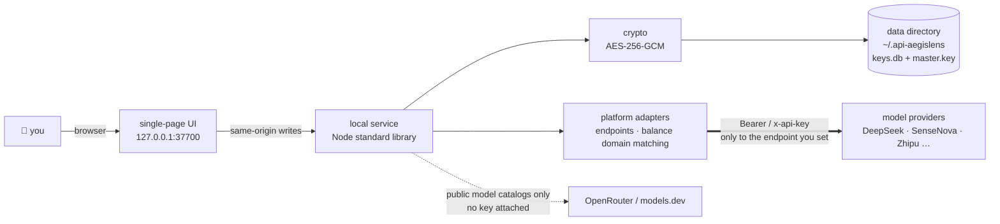

<div align="center">

# 🛡️ API-AegisLens

**A local-first AI API key manager** — enter once, see everything, use anywhere.


[简体中文](./README.md) ｜ [English](./README_EN.md) ｜ [Deployment guide](./DEPLOYMENT_EN.md)

</div>

> [!NOTE]
> Bring the API keys scattered across AI platforms into one local dashboard: field-level encrypted storage,
> connectivity testing, automatic model catalog fetching, and one-click config snippets for
> Dify / n8n / Claude Code / `.env`. The service listens on `127.0.0.1` only, and a key is sent
> **only to the endpoint you typed in** — online enrichment fetches public model catalogs and never carries a key.

---

## ⚡ Up and running in 30 seconds

```bash
git clone https://github.com/YYY-HUB-SYS/API-AegisLens.git
cd API-AegisLens/app
npm start
```

Then open <http://127.0.0.1:37700>. On Windows you can also double-click `app/start.bat`.
**Zero dependencies** — pure Node.js standard library, no `npm install` after cloning.

| Runtime | Storage backend used | Notes |
|---|---|---|
| Node.js **≥ 22** | SQLite (`keys.db`) | recommended; `node:sqlite` ships from Node 22 |
| Node.js 18 – 21 | JSON file (`store.json`) | identical features, silent fallback |

> [!WARNING]
> The two backends **do not migrate data between each other**. Keys entered on Node 20 will look gone after
> upgrading to 22 — nothing is lost, they are still in `store.json`. On startup the app now detects the other
> store and logs a `⚠ …另一份密钥库…` line. If you see it, check before you act, and **do not delete files**.

---

## 🧭 The day-to-day flow

```
add key → test connectivity → fetch models → generate config → record where it went
```

1. **Add a key** — pick a platform (13 built in, or custom), paste the key; the base URL and default model are filled in for you. Leave the name empty and it becomes the **last 4 characters** of the key
2. **Test connectivity** — validates against the platform's model list endpoint; endpoints without one fall back to an auth probe on the chat endpoint. Each address has its own test button, and the badge says **which endpoint** passed
3. **Fetch models** — values reported by the platform itself win; only the missing half falls through to the built-in metadata table → online lookup → manual entry
4. **Generate config** — Dify / n8n / Claude Code / `.env` templates, with model parameters and auth notes applied automatically
5. **Record usage** — keep track of which tools a given key was configured into

---

## 📦 Capabilities

| | Capability | In one line |
|---|---|---|
| 🔐 | Encrypted storage | Only the key field is AES-256-GCM encrypted; every other field is plaintext, and the master key sits next to the data |
| 🧪 | Connectivity testing | Per endpoint, with latency and the exact failure reason on the card |
| 🛰 | Model catalog | Automatic fetch plus a four-level fallback; Volcengine Ark Agent Plan ships with the official catalog |
| 🔌 | Multiple endpoints | Up to 6 base URLs per key (OpenAI / Anthropic / custom compatibility mode) |
| ⚙️ | Config generation | Dify / n8n / Claude Code / `.env`, with an explicit warning when the endpoint style does not fit |
| 💰 | Balance monitoring | Matched by endpoint **domain** against official APIs, so a custom platform pointing at an official domain still works |
| ⏳ | Expiry tracking | Due within 30 days / expired, detected automatically and flagged on the board |
| 🌐 | Proxy autodetection | Unreachable relays go through the system / environment proxy (CONNECT tunnel) |
| 📝 | Special auth notes | Per-key auth notes, pre-filled for platforms that need a custom header (e.g. Xiaohongshu Dots uses `api-key`) |
| 🧩 | Zero dependencies | Standard library only; the UI is a single file with no CDN and no external fonts |

---

## 🗺 Where the data goes



> [!IMPORTANT]
> **There is no authentication in this app** — it is designed to run on your own machine.
> The service binds to `127.0.0.1` and write requests are checked for same origin, but **any local process
> can read the decrypted keys**. Exposing it through nginx to a LAN or the public internet means everyone
> who can reach that address sees every key in plaintext. For remote use, take an SSH tunnel
> (see the [deployment guide](./DEPLOYMENT_EN.md)).

---

## 🔌 Endpoint style × target tool

Config generation picks an endpoint whose **style matches the tool**. When nothing matches it does not
quietly improvise — it says so inside the snippet.

| Target tool | Endpoint needed | Generates | When no matching endpoint exists |
|---|---|---|---|
| Dify | OpenAI compatible | model provider snippet | uses the first address and warns it may not connect |
| n8n | OpenAI compatible | Chat Model node parameters | same |
| Claude Code | **Anthropic compatible** | `ANTHROPIC_BASE_URL` / `ANTHROPIC_AUTH_TOKEN` | uses the first address and warns that `/v1/messages` is required |
| `.env` | OpenAI compatible | `AI_API_KEY` / `AI_BASE_URL` / `AI_MODEL`, etc. | same |

Connectivity testing and model fetching default to the **first** endpoint; you can also test or fetch from a
specific one via the buttons on that address row.

---

## 🧪 Tests

```bash
cd app
npm test
```

Coverage: encryption, storage (both backends plus shadow-store detection), API integration and validation,
platform adapters (catalog, balance domain matching, special auth), proxy and start scripts, frontend
templates and modal behaviour. The exact count moves with the code — **trust the command output**.
Measured on this fork on 2026-10-07 with Node v24.14.0: `tests 133 / pass 133 / fail 0`.

---

## 🗂 Repository layout

```
├── app/                      # main application (Node.js, zero dependencies)
│   ├── server.js             # entry point
│   ├── src/                  # crypto / storage / API / adapters / model fallback
│   ├── public/               # single-page front end
│   └── test/                 # tests
├── api-aegislens-prd/        # product design document (opens in a browser, in Chinese)
├── demo/                     # interactive demo page (fake data, no backend)
├── index.html                # project homepage
└── DEPLOYMENT_EN.md          # deployment · backup · upgrades
```

---

## ⚖️ Known limitations

We would rather list them here than let them surprise you.

- **The master key lives next to the data** — whoever holds the whole `~/.api-aegislens` directory holds plaintext keys. Treat backups at that sensitivity level
- **Exported JSON is plaintext** — the export file contains unencrypted keys; delete it once used. For routine backups, copy the data directory instead
- **Balance APIs cover three providers** — DeepSeek / Moonshot·Kimi / Zhipu. SiliconFlow's `/v1/user/info` was retired upstream on 2026-08-14 (410), so it is not listed
- **Custom compatibility modes cannot be auto-tested** — when an endpoint style is neither `openai` nor `anthropic`, connectivity testing and model fetching ask you to handle it manually
- **Online lookup is a guess** — the same model name has different limits at different providers, which is why platform-reported values win; anything resolved online stays labelled `web`
- **`index.html` is read into memory at startup** — editing the front end requires a service restart to take effect

---

## 🙏 License and credits

Released under the **MIT** license — see [LICENSE](./LICENSE).

This is a maintenance fork of [roseion/ai-key-manager](https://github.com/roseion/ai-key-manager).
The original design and implementation are by **Reinhard**: homepage <https://www.oldgao.com> · QQ 638694 · WeChat reincat.
On top of it, this branch renamed the project, moved the data directory out of the code tree, tightened the
encryption boundaries, and made the documentation match what the code actually does.
