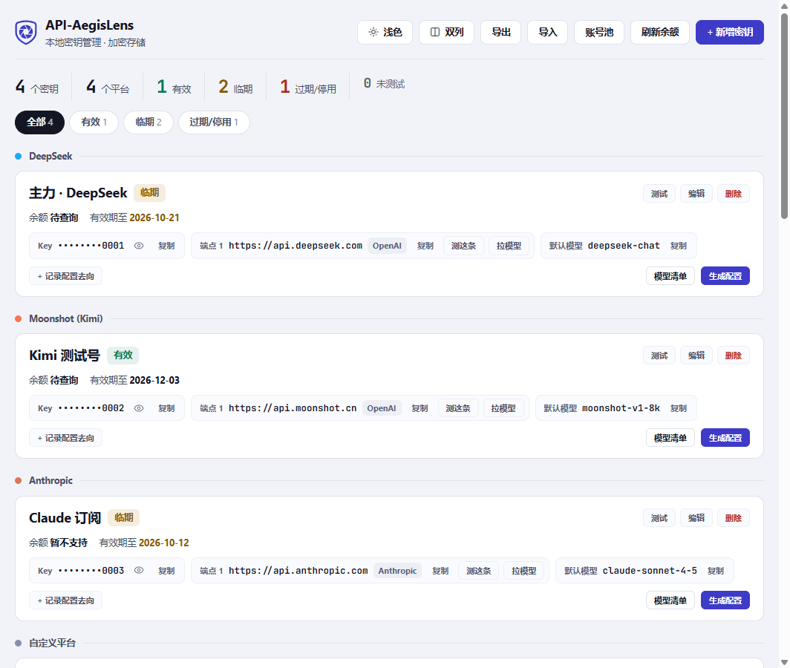
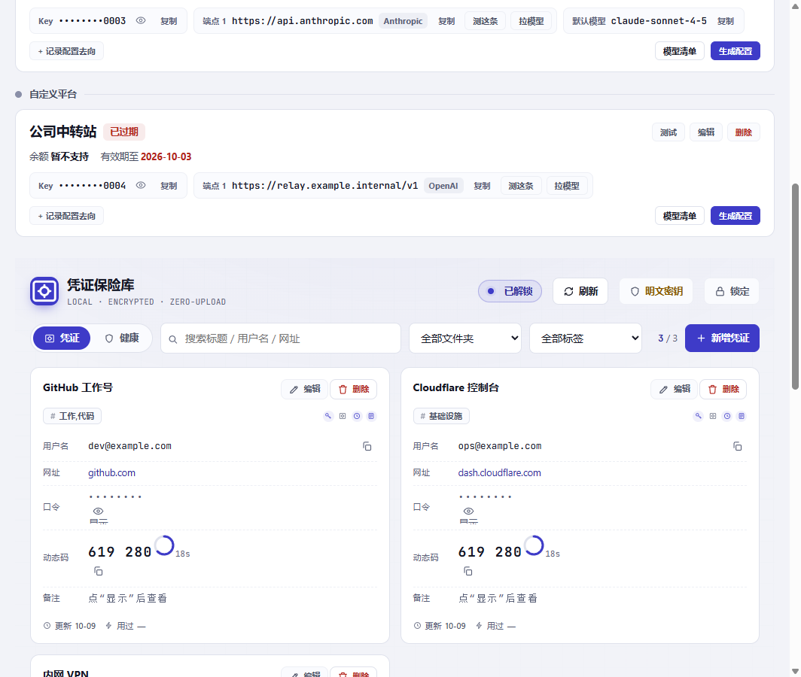
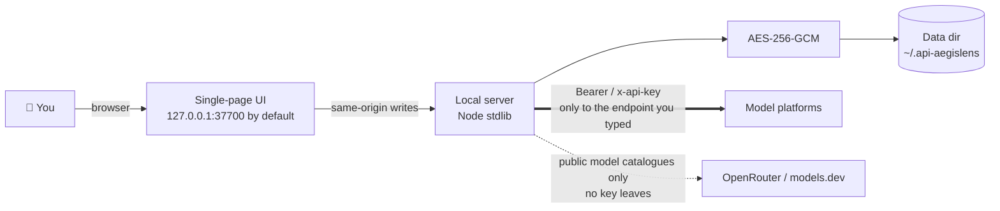

<div align="center">

# 🛡️ API-AegisLens

**A local-first vault for AI API keys.** Pull the keys and website passwords scattered across platforms, `.env` files and browser tabs into one folder on your own machine: field-level encryption, one-click connectivity tests, automatic model metadata, ready-made Dify / n8n / Claude Code / `.env` snippets, and narrow-scoped tokens for your scripts.


[简体中文](./README.md) ｜ [Deployment guide](./DEPLOYMENT_EN.md) ｜ [Security model](./SECURITY_EN.md) ｜ [API & limits](./docs/API_EN.md) ｜ [Product design doc](./api-aegislens-prd/api-aegislens-prd.html) (written before the implementation; includes unshipped items, divergence notice at the top of the page)
</div>



*This is the board (light is the default theme). The four keys in the picture are fake data from an isolated demo store (`sk-demo-*`). The UI itself is currently Chinese-only — these docs describe exactly what the Chinese labels say.*

*Not sure yet? Open [`demo/index.html`](./demo/index.html) in a browser — real UI, fake data, no Node required, nothing touches your disk.*

---

## Run it in 60 seconds

```bash
git clone https://github.com/YYY-HUB-SYS/API-AegisLens.git
cd API-AegisLens/app
npm start
```

Pure Node.js standard library — after `git clone` you do **not** need `npm install`. On Windows you can also double-click `app/start.bat`. This is what the terminal prints (captured on 2026-10-09 on Node v24 — that run pointed `AKM_DATA_DIR` at a temp folder; if you leave it alone the default is `~/.api-aegislens`):

```text
  API-AegisLens v0.1.0 已启动
  浏览器访问: http://127.0.0.1:37700
  数据目录: C:\Users\<you>\AppData\Local\Temp\aegis-firstboot
  存储后端: sqlite（密钥字段 AES-256-GCM 加密）
  保险库状态: 免密（未设解锁口令；设了之后重启即要求解锁）
  定时调度: 关闭（AKM_SCHEDULE_ENABLED=1 或 POST /api/schedule {"enabled":true} 开启）
  停止服务: 前台按 Ctrl+C；后台（--daemon）用 node server.js --stop
```

(The banner is Chinese-only for now.) Then open <http://127.0.0.1:37700>, paste a key, and you can test it, fetch its models and generate configs.

**Pitfalls you hit on the first run, stated up front:**

- Node **≥ 22** uses SQLite (`keys.db`); 18–21 silently falls back to JSON (`store.json`). Functionally identical, but **neither backend migrates the other**: if the list goes empty after a Node upgrade, nothing is lost — the data is still in `store.json`. When the other store is detected, startup logs `⚠ 数据目录里还有另一份密钥库`; **verify before doing anything, and do not delete files**
- `node:sqlite` is still marked experimental on Node 22+, so that `ExperimentalWarning` comes from Node, not from a bug here. Also: changes under `app/public/` need a **restart** — `index.html` is read into memory at boot

## Who it is for

- People juggling a dozen keys across DeepSeek / Kimi / Zhipu / Claude / Volcano Ark and managing them with notes and stray `.env` files
- People feeding keys to local scripts, agent frameworks or internal services — issue each consumer its own expiring, individually revocable token instead of sharing one master key
- Anyone who wants website passwords, API secrets and TOTP seeds in the same place, on their own machine, with no cloud in between
- One person with several machines, each keeping its own copy (the data directory moves as a whole)

## Who it is not for

- **A shared team key service** — there is no account system; it is one instance per machine
- **"Let programs call models without ever seeing the plaintext"** — that is a gateway's job and this tool does not do it: a consumer holding `key:read` still receives plaintext and calls the vendor itself
- **A machine you treat as untrusted** — the threat model explicitly does not defend against other processes on this host, see [Security model](./SECURITY_EN.md#what-is-not-defended-plainly)
- **A general password manager** — the credential vault covers passwords and TOTP you need on this machine; there is no KeePass (KDBX) import and no migration path from other managers

## What it does

Ten lines, and every one of them has a button in the UI:

- **Field-level encryption** // keys, website passwords, secrets, TOTP seeds and notes are each an AES-256-GCM ciphertext; list endpoints return only the last 4 characters, plaintext requires a single-item `reveal`
- **Unlock passphrase + 52-character recovery code** // scrypt(N=32768, r=8, p=1) derives a KEK that wraps the DEK; the passphrase is never written to any local file, the recovery code is shown exactly once
- **Idle auto-lock** // 5 minutes without real reads/writes locks the vault (`AKM_IDLE_LOCK_MINUTES`); the read-only endpoints the page polls do not count as usage
- **Connectivity test** // endpoints with `/models` use the list, the rest fall back to an auth probe on the chat endpoint; each base URL can be tested on its own and the badge says **which endpoint** passed
- **Four-tier model metadata fallback** // platform-reported first, then a built-in catalogue, then a public-directory web lookup, then manual; provenance is tracked per field, so values you edited survive a re-fetch
- **One-click config snippets** // Dify / n8n / Claude Code / `.env` templates; when the endpoint style does not match the target tool it warns instead of quietly emitting a broken config
- **Credential vault** // website passwords, API secrets and live TOTP codes; plaintext stays in memory for 30 seconds and is dropped immediately when the tab loses focus
- **Account pools** // group several keys and watch member health, through the same masked view — a locked vault answers `423` here too
- **Scoped consumer tokens** // 4 scopes + explicit resource lists + expiry + individual revocation; only the first 8 hex of an HMAC fingerprint is stored
- **Zero dependencies** // standard library only, single-file frontend, no CDN; the only binary in the repo is a vendored monospace font subset (OFL)

Every capability, endpoint, field limit and number lives in [API & limits](./docs/API_EN.md) — each path and each figure there is counted out of the source and re-checked against it by `app/test/docs.test.js`, so documenting an endpoint that does not exist turns the suite red.



*The unlocked credential vault: passwords stay masked, TOTP codes are generated on the spot (the ring follows the server's `step`), and plaintext is retracted after 30 seconds — or immediately when the tab loses focus.*

---

## Issuing a narrow-scoped key for a script (a real round trip)

All commands below were actually run; the keys come from an isolated folder of fake data (`sk-demo-*`). Mint a token that can read key 3 only and expires in 30 days:

```bash
curl -s -X POST http://127.0.0.1:37700/api/consumer/tokens \
  -H 'Content-Type: application/json' \
  -d '{"label":"my-agent","scopes":["key:read"],"keyIds":[3],"ttlSeconds":2592000}'
```

The response has 17 keys; the plaintext `token` **appears only in this one response** (227 characters, starting with `v1.`) — the database keeps just the HMAC fingerprint:

```json
{"token":"v1.eyJ0aWQiOiI…","fingerprint":"c39499dc","label":"my-agent",
 "scopes":["key:read"],"keyIds":[3],"resourceCount":1,"expiresAt":"2026-11-08T14:24:28.000Z"}
```

With it, the listed key returns 200, an unlisted key 403, and no header at all 401:

```bash
curl -s http://127.0.0.1:37700/api/consumer/keys/3 -H "Authorization: Bearer $TOKEN"
# 200 {"id":3,"name":"Claude 订阅","platform":"anthropic","key":"sk-demo-anthropic-0003"}
curl -s http://127.0.0.1:37700/api/consumer/keys/1 -H "Authorization: Bearer $TOKEN"
# 403 {"error":"令牌的作用域不覆盖这个资源","reason":"scope"}
curl -s http://127.0.0.1:37700/api/consumer/keys/3
# 401 {"error":"缺少 Authorization: Bearer <token>","reason":"missing"}
```

Three boundaries worth knowing before you build on this:

- **Changing the passphrase revokes nothing** — setting or changing the passphrase, or discarding `master.key`, only re-wraps the DEK; token validity is bound to the DEK itself. This was measured end to end, not inferred. Use "Revoke" in the UI to retire a token
- **After a restart, consumers get `423` first** on an installation that has a passphrase — without the DEK the server cannot even answer "did I sign this token", so it reports "server locked", not "your token is broken". Unlock once by hand, or set `AKM_PASSPHRASE` for non-interactive use (the trade-off is in the deployment guide)
- **Resource lists are enumerations, not wildcards** — an empty list means "not one record readable"; grant everything by listing everything

---

## Where the data goes



> [!IMPORTANT]
> **Threat model: other processes on this machine are out of scope.**
> The server binds `127.0.0.1` by default, list endpoints return only the last 4 characters, and plaintext requires a single-item `reveal` (session-gated, rate-limited, audited).
> But **the default install is passphrase-free**: any local process running as you can still walk the keys one by one. Once a passphrase is set, the key, credential and pool endpoints all answer `423` until the vault is unlocked.
> Expose it through nginx or similar and anyone who can reach that address can read this data — for remote use, go through an SSH or WireGuard tunnel (see the [deployment guide](./DEPLOYMENT_EN.md#lan-and-remote-access)).
> The full trust-boundary list, including the precondition of every defence and **what is explicitly not defended**, is in the [security model](./SECURITY_EN.md).

## Known limitations

Listed so that they never arrive as a surprise.

- On a passphrase-free install a local process can still read keys one by one: neither `reveal` nor token minting needs a credential (the latter has its own rate-limit bucket and is audited by fingerprint only) — setting a passphrase is what tightens this
- The DEK still lives next to the data by default; "copying the folder is not enough to decrypt" requires discarding the plaintext master key once (**irreversible**, and the server only allows it after a real passphrase unlock)
- Consumer tokens are not "boot-and-go": once a passphrase is set, somebody must unlock after a restart, and valid tokens get `423` until then
- A token is not a gateway — this tool does not proxy requests. Forget the passphrase and the only way in is that 52-character recovery code; lose both and the vault is permanently unreadable. There is no backdoor
- Exported JSON **omits the `key` field entirely** by default; including plaintext needs an explicit opt-in and item-by-item retrieval. For backups, copy the data directory instead
- No KeePass (KDBX) import (KDBX4 needs a full variant-KDF and HMAC-block implementation, out of scope for a zero-dependency project); balance queries cover DeepSeek / Moonshot·Kimi / Zhipu only (SiliconFlow's `/v1/user/info` was retired by the vendor with HTTP 410 on 2026-08-14)
- Endpoints whose style is neither `openai` nor `anthropic` are not auto-tested, and web-filled metadata is a guess too: the same model id has different limits at different providers, so platform-reported values win and anything from the web is labelled `web`
- The `type` field of an import file is validated in the frontend only; `POST /api/import` accepts any `keys` array (closing this properly needs both sides, see the deployment guide note)
- There is no countdown before the auto-lock. The door used to show one, but it was dead code: it read `idleRemainingMs`, which is always `0` while **locked**, and the door only appears while locked — so it never rendered, and it has been removed
- Three capabilities have endpoints but no UI entry: observation history (last 1000 rows per key), the scheduler toggle, and `/api/meta` detail. They are listed here so endpoints are not sold as features

---

## Development

```bash
cd app && npm test        # same as node --test test/*.test.js
```

Measured on this version on 2026-10-10 with Node v24.14.0: `tests 503 / pass 503 / fail 0` — the count moves with the code, so trust the run. Coverage: crypto, vault sessions and rate limiting, the recovery envelope, both storage backends plus shadow-store detection, credential routes, consumer token minting / verification / revocation / the gating order of all four data routes, TOTP and password generation, API integration and validation, platform adapters, proxy and start scripts, frontend templates and modals, reclamation of the scratch directories tests create (`tmp-sweep.test.js`) — plus `docs.test.js`, which watches that the documentation and the code still agree.

## Reporting a vulnerability / backups

Please do not open a public issue — follow the "Reporting a security issue" section of [SECURITY_EN.md](./SECURITY_EN.md#reporting-a-security-issue).
Backups are simple: the data directory is a handful of files (`keys.db` + `master.key`, plus `vault.key` / `recovery.env` once a passphrase is set), and **copying the whole directory is the backup**. The recovery code exists in no file after its single appearance — write it on paper. Machine moves, autostart, daemon mode and proxy configuration are in the [deployment guide](./DEPLOYMENT_EN.md).

## License and credits

Released under the **MIT** licence, see [LICENSE](./LICENSE). **The original design and implementation come from Reinhard, author of [roseion/ai-key-manager](https://github.com/roseion/ai-key-manager)** (homepage <https://www.oldgao.com> · QQ 638694 · WeChat reincat): field-level encrypted storage, the platform adapters, model catalogue fetching and the config generator are his, and his copyright line is kept verbatim as MIT requires.

This version was built on top of it by **YYY-HUB-SYS**, and the amount of change is measurable. Method: run `git blame --line-porcelain` on the 36 files listed by `git ls-files app/src app/public index.html` and count by `author`. These figures are a snapshot **at `c298881`** (17,073 lines in total) — 12,568 lines (73.6%) from this version, 4,505 (26.4%) from upstream. Of those, 12 JS files and 2 CSS files are modules written here (`vault.js`, `recovery.js`, `credentials-api.js`, `consumer-tokens.js`, `consumer-api.js`, `totp.js`, `passgen.js`, `scheduler.js`, `daemon.js`, `model-shape.js` and the two frontend views), while 2 JSON files and 1 font file are third-party material from **other** upstreams — not ours.

Added or rewritten by this version: the passphrase envelope and recovery codes, idle auto-lock, rate limiting with desensitised audit, the closure of six families of plaintext exits, the credential vault, TOTP and the password generator, scoped consumer tokens, the scheduler, daemonisation plus the invariant "a non-loopback bind requires a passphrase first", the [security model](./SECURITY_EN.md), and both language doc sets corrected line by line against measured behaviour. Licences and provenance checks for the vendored third-party material (Lucide ISC + some Feather MIT, JetBrains Mono OFL, Apple `password-manager-resources` MIT) are in the [supply-chain section](./SECURITY_EN.md#supply-chain-and-telemetry).
