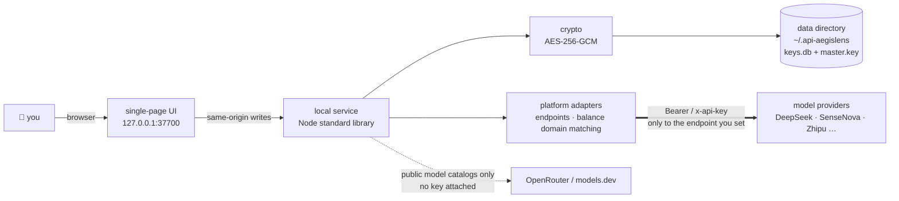

<div align="center">

# 🛡️ API-AegisLens

**A local-first AI API key manager** — enter once, see everything, use anywhere.


[简体中文](./README.md) ｜ [English](./README_EN.md) ｜ [Deployment guide](./DEPLOYMENT_EN.md) ｜ [Security model](./SECURITY_EN.md)

</div>

> [!NOTE]
> Bring the API keys scattered across AI platforms into one local dashboard: field-level encrypted storage,
> connectivity testing, automatic model catalog fetching, and one-click config snippets for
> Dify / n8n / Claude Code / `.env`. The service listens on `127.0.0.1` only, and a key is sent
> **only to the endpoint you typed in** — online enrichment fetches public model catalogs and never carries a key.

---

## ⚡ Up and running in 30 seconds

```bash
git clone https://github.com/YYY-HUB-SYS/API-AegisLens.git
cd API-AegisLens/app
npm start
```

Then open <http://127.0.0.1:37700>. On Windows you can also double-click `app/start.bat`.
**Zero dependencies** — pure Node.js standard library, no `npm install` after cloning.

| Runtime | Storage backend used | Notes |
|---|---|---|
| Node.js **≥ 22** | SQLite (`keys.db`) | recommended; `node:sqlite` ships from Node 22 |
| Node.js 18 – 21 | JSON file (`store.json`) | identical features, silent fallback |

> [!WARNING]
> The two backends **do not migrate data between each other**. Keys entered on Node 20 will look gone after
> upgrading to 22 — nothing is lost, they are still in `store.json`. On startup the app now detects the other
> store and logs a `⚠ …另一份密钥库…` line. If you see it, check before you act, and **do not delete files**.

---

## 🧭 The day-to-day flow

```
add key → test connectivity → fetch models → generate config → record where it went
```

1. **Add a key** — pick a platform (13 built in, or custom), paste the key; the base URL and default model are filled in for you. Leave the name empty and it becomes the **last 4 characters** of the key
2. **Test connectivity** — validates against the platform's model list endpoint; endpoints without one fall back to an auth probe on the chat endpoint. Each address has its own test button, and the badge says **which endpoint** passed
3. **Fetch models** — values reported by the platform itself win; only the missing half falls through to the built-in metadata table → online lookup → manual entry
4. **Generate config** — Dify / n8n / Claude Code / `.env` templates, with model parameters and auth notes applied automatically
5. **Record usage** — keep track of which tools a given key was configured into

---

## 📦 Capabilities

| | Capability | In one line |
|---|---|---|
| 🔐 | Encrypted storage | Only the secret fields are AES-256-GCM encrypted at rest; an optional unlock passphrase wraps the master key with a scrypt-derived key |
| 🗝️ | Credential vault | Website logins, TOTP secrets (live codes), API keys and notes, field-level encrypted the same way, with a generator and reuse/weak-password checks |
| 🎟️ | Consumer-scoped tokens | Every server-side process gets its own narrow, expiring, individually revocable bearer token instead of sharing one master key with twenty consumers — see [scoped tokens](#-machine-consumers-scoped-tokens) |
| 🧪 | Connectivity testing | Per endpoint, with latency and the exact failure reason on the card |
| 🛰 | Model catalog | Automatic fetch plus a four-level fallback; Volcengine Ark Agent Plan ships with the official catalog |
| 🔌 | Multiple endpoints | Up to 6 base URLs per key (OpenAI / Anthropic / custom compatibility mode) |
| ⚙️ | Config generation | Dify / n8n / Claude Code / `.env`, with an explicit warning when the endpoint style does not fit |
| 💰 | Balance monitoring | Matched by endpoint **domain** against official APIs, so a custom platform pointing at an official domain still works |
| ⏳ | Expiry tracking | Due within 30 days / expired, detected automatically and flagged on the board |
| 🌐 | Proxy autodetection | Unreachable relays go through the system / environment proxy (CONNECT tunnel) |
| 📝 | Special auth notes | Per-key auth notes, pre-filled for platforms that need a custom header (e.g. Xiaohongshu Dots uses `api-key`) |
| 🧩 | Zero dependencies | Standard library only, no `npm install`; the UI is a single file with no CDN. The only binary shipped in the repo is a local vendored monospace font subset (OFL licensed, see `app/public/vendor/fonts/CREDITS.md`) |

---

## 🗺 Where the data goes



> [!IMPORTANT]
> **Threat model: other processes on this machine are out of scope.**
> The service binds to `127.0.0.1` by default, and list endpoints **return only the last 4 characters** of a
> key; plaintext comes out of exactly one route, `POST /api/keys/:id/reveal`, gated by the session,
> rate-limited and audited. But **the default install is passphrase-free**: until you set an unlock
> passphrase, any local process running as you can still reveal keys one by one. Once a passphrase is set,
> the key, credential and pool routes all answer `423` until you unlock.
> If a server-side program needs these keys, do not hand it that one master key — issue it a
> [scoped consumer token](#-machine-consumers-scoped-tokens) instead.
> Exposing it through nginx to a LAN or the public internet means everyone who can reach that address sees
> this data. For remote use, take an SSH tunnel (see the
> [deployment guide](./DEPLOYMENT_EN.md#lan-and-remote-access)).
> The full list of trust boundaries — including the precondition each defence depends on, and an explicit list of
> **what is not defended** — is in the [security model](./SECURITY_EN.md).

---

## 🔑 Machine consumers: scoped tokens

If several server-side programs need these keys (CLIs, agent frameworks, internal services), do not let
them share your unlock passphrase and do not let them scrape `GET /api/keys`. Issue each consumer its own
**narrow, expiring, individually revocable** token:

| scope | Route it unlocks | What comes back |
|---|---|---|
| `key:read` | `GET /api/consumer/keys/:id` | the plaintext of that key |
| `key:test` | `POST /api/consumer/keys/:id/test` | the connectivity result — **not** the plaintext |
| `balance:read` | `GET /api/consumer/keys/:id/balance` | the stored balance snapshot (does not refresh) |
| `cred:read` | `GET /api/consumer/credentials/:id` | that credential's plaintext password / TOTP seed |

Every scope also carries a **resource allow-list** (which key ids, which credential ids). The list is an
enumeration, not a wildcard: an empty list means "reads nothing", and granting everything means listing
everything. Revoking a key therefore does not leave an old token silently still covering it.

Issuance happens in the UI (the token string is shown **once, at creation**; afterwards the store keeps only
its HMAC fingerprint, and so do the logs and the audit ring). From the command line it is the same:

```bash
curl -s -X POST http://127.0.0.1:37700/api/consumer/tokens \
  -H 'Content-Type: application/json' \
  -d '{"label":"my-agent","scopes":["key:read"],"keyIds":[3],"ttlSeconds":2592000}'

curl -s http://127.0.0.1:37700/api/consumer/keys/3 \
  -H 'Authorization: Bearer v1.xxxxx.yyyyy'
```

Three boundaries are worth knowing before they bite you in production:

- **Changing the passphrase revokes nothing.** Setting, changing or discarding `master.key` all keep the same
  DEK (they only re-wrap it), and token validity is bound to the DEK alone — measured end to end, not inferred.
  To take a token down, use "revoke" in the UI.
- **After a reboot, consumers get `423` first.** Without a DEK the service cannot even answer "did I sign this
  token", so it reports "the server is locked" rather than "your token is broken". Either unlock once in the
  browser, or use `AKM_PASSPHRASE` in non-interactive setups (at the cost described in the deployment guide).
- **Denials are typed, not one flat 401**: `missing` / `malformed` / `bad-signature` / `expired` / `revoked` /
  `unknown` return 401, insufficient scope returns 403, a locked vault returns 423. `unknown` (valid signature,
  tid not in the store) is exactly what a rebuilt vault or a different data directory looks like.

---

## 🔌 Endpoint style × target tool

Config generation picks an endpoint whose **style matches the tool**. When nothing matches it does not
quietly improvise — it says so inside the snippet.

| Target tool | Endpoint needed | Generates | When no matching endpoint exists |
|---|---|---|---|
| Dify | OpenAI compatible | model provider snippet | uses the first address and warns it may not connect |
| n8n | OpenAI compatible | Chat Model node parameters | same |
| Claude Code | **Anthropic compatible** | `ANTHROPIC_BASE_URL` / `ANTHROPIC_AUTH_TOKEN` | uses the first address and warns that `/v1/messages` is required |
| `.env` | OpenAI compatible | `AI_API_KEY` / `AI_BASE_URL` / `AI_MODEL`, etc. | same |

Connectivity testing and model fetching default to the **first** endpoint; you can also test or fetch from a
specific one via the buttons on that address row.

---

## 🧪 Tests

```bash
cd app
npm test
```

Coverage: encryption, vault session with idle auto-lock and throttling, the recovery envelope, storage (both
backends plus shadow-store detection), credential routes, consumer-scoped tokens (issue / verify / revoke, and
the ordering of the gates on all four data routes), TOTP and password generation, API integration and
validation, platform adapters (catalog, balance domain matching, special auth), proxy and start scripts,
frontend templates and modal behaviour. The exact count moves with the code — **trust the command output**.
Measured on this fork on 2026-10-09 with Node v24.14.0: `tests 459 / pass 459 / fail 0`.

---

## 🗂 Repository layout

```
├── app/                      # main application (Node.js, zero dependencies)
│   ├── server.js             # entry point
│   ├── src/                  # crypto / storage / API / adapters / model fallback
│   ├── public/               # single-page front end
│   └── test/                 # tests
├── api-aegislens-prd/        # product design document (opens in a browser, in Chinese)
├── demo/                     # interactive demo page (fake data, no backend)
├── index.html                # project homepage
├── SECURITY_EN.md            # threat model: who is defended against, who is not, and each precondition
└── DEPLOYMENT_EN.md          # deployment · backup · upgrades
```

---

## ⚖️ Known limitations

We would rather list them here than let them surprise you.

- **Without a passphrase, local processes can still reveal keys one by one** — the gate is open by default; lists show only the last 4 characters, but `reveal` needs no credential. Setting a passphrase is what closes this
- **The DEK still sits next to the data by default** — a passphrase only wraps it. To reach "copying the directory gets you nothing", use "credential vault → plaintext key" to discard `master.key` (irreversible, and the server only allows it after a passphrase-verified unwrap succeeds). The button does not appear at all while no passphrase is set — deleting `master.key` then would destroy the vault
- **Machine consumers are not "boot and go"** — once a passphrase is set, somebody has to unlock after a reboot (or you configure `AKM_PASSPHRASE` for non-interactive runs); until then, even a perfectly valid token gets `423`. This is not an oversight: a credential that unlocks automatically must exist in plaintext somewhere on this machine, which is exactly what this design refuses to do. Once unlocked there is no "every five minutes we drop the consumers" cliff either — each accepted token request counts as real use and extends the idle clock; the vault only locks when nobody is using it
- **On a passphrase-free install the issuing route is as open as `reveal`** — it has its own rate-limit bucket and the audit ring records only HMAC fingerprints, but with no passphrase set it asks for nothing. Setting a passphrase is the fix
- **A token is not a gateway** — a consumer with `key:read` still receives the plaintext key and calls the provider itself. "let a program use the model without ever touching the key" is a relay gateway, which this tool does not have yet
- **A forgotten passphrase means the recovery code is the only way out** — it is shown once when you set the passphrase and never stored. Lose both and the vault is permanently unreadable; there is no backdoor
- **No KeePass (KDBX) import** — KDBX4 needs a full variant-KDF and HMAC-block implementation, outside the zero-dependency scope. Credentials also have **no** import path from other password managers; only this tool's own export format is accepted
- **Exported JSON has no plaintext keys by default** — you must explicitly tick "include plaintext keys (at your own risk)", which reveals them one by one. For routine backups, copy the data directory instead
- **Balance APIs cover three providers** — DeepSeek / Moonshot·Kimi / Zhipu. SiliconFlow's `/v1/user/info` was retired upstream on 2026-08-14 (410), so it is not listed
- **Custom compatibility modes cannot be auto-tested** — when an endpoint style is neither `openai` nor `anthropic`, connectivity testing and model fetching ask you to handle it manually
- **Online lookup is a guess** — the same model name has different limits at different providers, which is why platform-reported values win; anything resolved online stays labelled `web`
- **The export `type` is validated in the UI only** — the interface rejects foreign files, but `POST /api/import` looks at `keys` alone. This is deliberate: the front end never forwards `type`, so a mandatory backend check would break the app's own import, and a "check it only if present" rule stops nothing that an omitted field could bypass. Closing it properly takes a change on both sides
- **`index.html` is read into memory at startup** — editing the front end requires a service restart to take effect

---

## 🙏 License and credits

Released under the **MIT** license — see [LICENSE](./LICENSE).

This is a maintenance fork of [roseion/ai-key-manager](https://github.com/roseion/ai-key-manager).
The original design and implementation are by **Reinhard**: homepage <https://www.oldgao.com> · QQ 638694 · WeChat reincat.
On top of it, this branch renamed the project, moved the data directory out of the code tree, tightened the
encryption boundaries, and made the documentation match what the code actually does.
