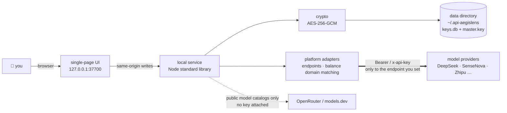

<div align="center">

# 🛡️ API-AegisLens

**A local-first AI API key manager** — enter once, see everything, use anywhere.


[简体中文](./README.md) ｜ [English](./README_EN.md) ｜ [Deployment guide](./DEPLOYMENT_EN.md) ｜ [Security model](./SECURITY_EN.md)

</div>

> [!NOTE]
> Bring the API keys scattered across AI platforms into one local dashboard: field-level encrypted storage,
> connectivity testing, automatic model catalog fetching, and one-click config snippets for
> Dify / n8n / Claude Code / `.env`. By default the service listens on `127.0.0.1` only, and a key is sent
> **only to the endpoint you typed in** — online enrichment fetches public model catalogs and never carries a key.

---

## ⚡ Up and running in 30 seconds

```bash
git clone https://github.com/YYY-HUB-SYS/API-AegisLens.git
cd API-AegisLens/app
npm start
```

Then open <http://127.0.0.1:37700>. On Windows you can also double-click `app/start.bat`.
**Zero dependencies** — pure Node.js standard library, no `npm install` after cloning.

| Runtime | Storage backend used | Notes |
|---|---|---|
| Node.js **≥ 22** | SQLite (`keys.db`) | recommended; `node:sqlite` ships from Node 22 |
| Node.js 18 – 21 | JSON file (`store.json`) | identical features, silent fallback |

> [!WARNING]
> The two backends **do not migrate data between each other**. Keys entered on Node 20 will look gone after
> upgrading to 22 — nothing is lost, they are still in `store.json`. On startup the app now detects the other
> store and logs a `⚠ …另一份密钥库…` line. If you see it, check before you act, and **do not delete files**.

---

## 🧭 The day-to-day flow

```
add key → test connectivity → fetch models → generate config → record where it went
```

1. **Add a key** — pick a platform (13 built in, or custom), paste the key; the base URL and default model are filled in for you. Leave the name empty and it becomes the **last 4 characters** of the key
2. **Test connectivity** — validates against the platform's model list endpoint; endpoints without one fall back to an auth probe on the chat endpoint. Each address has its own test button, and the badge says **which endpoint** passed
3. **Fetch models** — values reported by the platform itself win; only the missing half falls through to the built-in metadata table → online lookup → manual entry
4. **Generate config** — Dify / n8n / Claude Code / `.env` templates, with model parameters and auth notes applied automatically
5. **Record usage** — keep track of which tools a given key was configured into

Beyond that main line the interface has three independent panels: the **credential vault**
(site passwords / API private keys / TOTP), **account pools** (group several keys and watch
member health together), and **consumer tokens** (narrow-scoped keys for local scripts).
Every capability and the route behind it are listed in the [feature map](#-feature-map).

---

## 🧩 Feature map

Every row below points at **an entry in the interface** and at **the route behind it**, and both sides were
counted out of this repository (as of `646afc7`: `app/src/api.js` + `credentials-api.js` + `consumer-api.js`
come to **47 routes** as method + path combinations, **38 path shapes** after deduplication; the UI actions
`data-act` dedupe to **64**). `app/test/docs.test.js` re-checks those two numbers against the code — change a
route without updating the docs and it goes red. Anything that has a route but no entry in the interface is
kept in [this section](#-apis-with-no-ui-entry-yet) rather than padded into this one.

### Keys and endpoints

| Capability | UI entry | Route | Limits |
|---|---|---|---|
| Platform catalog | add-key form → platform dropdown | `GET /api/platforms` | **13** built in + custom; a custom platform may pick one of three endpoint styles: OpenAI / Anthropic / custom |
| CRUD | "+ add key", card "edit / delete" | `POST` `PUT` `DELETE /api/keys/{id}` | an empty name falls back to the last 4 characters of the key |
| Lists only return masks | the board itself | `GET /api/keys` | the last 4 characters and nothing else; neither the ciphertext nor the plaintext leaves this route |
| Plaintext on demand | card "reveal" | `POST /api/keys/{id}/reveal` | needs an unlocked session; its own rate-limit tier (the 20/30 one) and audited |
| Multiple compatible endpoints | "+ add endpoint" in the form | with `POST/PUT /api/keys` | **capped at 6, checked once on each side** (`MAX_EPS` in the front end, `normEps()` in the back end; sending 7 measured as a straight 400 `最多支持 6 个 Base URL` — "at most 6 base URLs are supported"); each one can be tested and can fetch models on its own |
| Connectivity test | "test" on the card / on an endpoint row | `POST /api/keys/{id}/test` | uses the model-list route where there is one, otherwise an auth probe on the chat endpoint; the badge says **which endpoint number** passed |
| Special auth | card "auth notes" | part of the platform catalog | preset per platform (e.g. the `api-key` header for Xiaohongshu Dots), overridable entry by entry |

### Model catalog and parameters

| Capability | UI entry | Route | Limits |
|---|---|---|---|
| Fetch the model list | card "models" → "fetch" | `POST /api/keys/{id}/models/fetch` | context / max output reported by the platform itself **take precedence** |
| Four-level fallback enrichment | "fill in unknowns" | `POST /api/keys/{id}/models/enrich` | platform route → built-in metadata table → online lookup of public catalogs → manual; the online step sends no user data |
| Add a model / edit parameters by hand | "add manually" and "note" on a model row | `POST /api/keys/{id}/models`, `PATCH .../models/{modelId}` | PATCH only edits rows that **already exist**; anything else gets 404, no row is invented |
| Marking by field provenance | the provenance tag on a model row | same as above | `ctxSrc` / `outSrc` are one of api / meta / web / manual / builtin; a field a person changed survives a re-fetch |
| Capability flags | expand a model row | same as above | `reasoning`, `modalitiesIn`, `rpm`, plus the two warning flags `outGtCtx` / `conflict` |
| Default model | "set as default" on a model row | `PUT /api/keys/{id}` | read by both config generation and the board |
| Endpoints with no model-list route | same as above | `POST /api/keys/{id}/models/fetch` | for endpoints that have not implemented `/models` (Volcengine Ark Agent Plan and the like), key usability is confirmed against the **built-in official model catalog** and the provenance is marked `builtin` |

### Config generation and destinations

| Capability | UI entry | Route | Limits |
|---|---|---|---|
| One-click config snippet | card "generate config" | rendered in the front end only | four templates — Dify / n8n / Claude Code / `.env` — with model parameters and auth notes filled in |
| Endpoint-style validation | same, warning at the top | — | warns outright when the compatibility mode does not match what the target tool expects, instead of silently emitting a wrong config |
| Copy the whole block | "copy the whole snippet" | — | uses `navigator.clipboard`, falls back to `execCommand` |
| Record destinations | "mark as configured" | `POST` `DELETE /api/keys/{id}/assigned` | which tools this key was configured into, visible at a glance on the card |

### Balance, expiry and account pools

| Capability | UI entry | Route | Limits |
|---|---|---|---|
| Balance check | "refresh balance" | `POST /api/refresh-balances` | covers DeepSeek / Moonshot·Kimi / Zhipu; matched by endpoint **domain**, so a custom platform pointing at an official domain can be queried too |
| Expiry status | status badge on the card | with `GET /api/keys` | more than 30 days left is "valid", within 30 days is "expiring soon", past the date is "expired" |
| Observation history | ⚠️ no UI entry yet | `GET /api/keys/{id}/history?kind=test\|balance` | the most recent **1000** rows per key, 200 rows read back by default |
| Scheduled refresh | ⚠️ no UI switch yet | `GET` `POST /api/schedule` | **off by default**; the interval defaults to 60 minutes and is clamped between 1 minute and 7 days; runtime changes do not persist |
| Account pools | "pools" in the top bar | `GET` `POST /api/pools`, `PUT` `DELETE /api/pools/{id}`, `POST` `DELETE /api/pools/{id}/keys[/{keyId}]` | unique names, ≤40 characters; members still expose only the last 4 characters, and the routes answer `423` while locked |

### Credential vault (site passwords / private keys / two-factor)

| Capability | UI entry | Route | Limits |
|---|---|---|---|
| Credential CRUD | credential panel | `GET` `POST /api/credentials`, `GET` `PUT` `DELETE /api/credentials/{id}` | title ≤200, private key ≤512 characters; password / private key / TOTP seed / note are four fields encrypted separately |
| Plaintext on demand | "show / hide" | `POST /api/credentials/{id}/reveal` | its own rate-limit tier; plaintext lives in memory only, retracted after 30 seconds and retracted immediately when you switch tabs |
| Two-factor codes | the live-code ring | `GET /api/credentials/{id}/totp` | accepts bare Base32 and a whole `otpauth://` URI; `period` / `digits` / `algorithm` follow the URI, and the ring progress follows the server's `step` |
| Password generator | the generator inside the form | front end only (`node:crypto` CSPRNG) | length 8–64, four character classes, look-alike characters can be excluded; reads the site's rules |
| Per-site password rules | the hint line above | `GET /api/credentials/{id}/password-policy` | the rules table comes from Apple's public data (MIT, licence ships in the repo); falls back to the default rules when it cannot be resolved |
| Health check | the "health" tab of the panel | `GET /api/credentials/health` | reused usernames, weak passwords, passwords past their change deadline; **returns no password content** |

### Machine consumers and scoped tokens

The full write-up is in [this section](#-machine-consumers-scoped-tokens). Quick view:

| Capability | UI entry | Route |
|---|---|---|
| Issue / revoke / list | consumer-token panel | `GET` `POST /api/consumer/tokens`, `POST /api/consumer/tokens/{tid}/revoke` |
| A machine reads key plaintext / runs a test / reads a balance / reads a credential | — (for scripts) | `GET /api/consumer/keys/{id}`, `POST .../test`, `GET .../balance`, `GET /api/consumer/credentials/{id}` |
| Scopes | the four checkboxes on the issuing form | 4 of them: `key:read` `key:test` `balance:read` `cred:read`; an empty resource list = not a single item readable |

### Vault and session security

| Capability | UI entry | Limits |
|---|---|---|
| Unlock passphrase | forced on the first visit to the panel | at least 8 characters; a scrypt(N=2^15, r=8, p=1)-derived KEK wraps the DEK |
| Recovery code | the screen where you set the passphrase | 52 characters / 256 bits, **never written to disk**, and shown that one time only |
| Forgotten passphrase | "reset with a recovery code" on the gate | after a reset the recovery code rotates on the spot; no recovery code plus an already-discarded plaintext master key = permanently unopenable |
| Discard the plaintext master key | "plaintext key" in the panel | the only irreversible action; before it, an actual unwrap with the passphrase must have succeeded; the button does not appear at all on a passphrase-free install |
| Idle auto-lock | none (tunable via `AKM_IDLE_LOCK_MINUTES`, default 5 minutes) | only requests that actually read or write data extend the clock; the read-only routes the page polls do **not**; a passphrase-free install has no lock to engage |
| Rate-limit tiers | none | unlock 5 / plaintext reveal 30 / credentials 20 / tokens 20 / passphrase change 5, a 5-minute lock window, and the tiers do not cover for each other |
| Audit | the `recent` field of `GET /api/vault/status` | records only the action, the target id and the result; not one byte of plaintext or passphrase enters the audit |

### Operations and the interface

| Capability | Entry | Notes |
|---|---|---|
| Foreground run | `cd app && npm start` | logs go to the terminal, Ctrl+C stops it |
| Background run | `node server.js --daemon` / `--stop` | the pid and the port are written to `server.pid` in the data directory; `--stop` only acts when the process is alive and the port matches |
| Windows double-click | `app/start.bat` / `app/stop.bat` | starts it in the background and opens the browser automatically; closing that popup does not stop the service |
| Handing it to another supervisor | `app/workbench.bat` + `workbench.json` | stays in the foreground on purpose; the process and its logs belong to the supervisor |
| Start at boot | launchd / systemd / Task Scheduler | set `AKM_PASSPHRASE` for non-interactive runs; a wrong passphrase exits as a failed start instead of dressing up as "started, just locked" |
| Proxy | `AKM_PROXY` | `off` forces a direct connection; by default it looks at the environment variables first, then the Windows system proxy (CONNECT tunnel) |
| Two storage backends | automatic | Node ≥22 takes SQLite, 18–21 falls back to JSON silently; **neither side migrates the other**, and startup reports the shadow store |
| Import / export | "export / import" in the top bar | exports **leave out even the key field** by default; including plaintext takes an explicit tick and is then fetched entry by entry |
| Theme / single column | the two switches in the top bar | light is the default; narrow screens can switch to a single column |
| Zero dependencies | — | standard library only, no `npm install`; the front end is a single file with no CDN, and the only binary shipped in the repo is the locally vendored monospace font subset (OFL) |

---

## 🗺 Where the data goes



> [!IMPORTANT]
> **Threat model: other processes on this machine are out of scope.**
> The service binds to `127.0.0.1` by default, and list endpoints **return only the last 4 characters** of a
> key; plaintext comes out of exactly one route, `POST /api/keys/:id/reveal`, gated by the session,
> rate-limited and audited. But **the default install is passphrase-free**: until you set an unlock
> passphrase, any local process running as you can still reveal keys one by one. Once a passphrase is set,
> the key, credential and pool routes all answer `423` until you unlock.
> If a server-side program needs these keys, do not hand it that one master key — issue it a
> [scoped consumer token](#-machine-consumers-scoped-tokens) instead.
> Exposing it through nginx to a LAN or the public internet means everyone who can reach that address sees
> this data. For remote use, take an SSH tunnel (see the
> [deployment guide](./DEPLOYMENT_EN.md#lan-and-remote-access)).
> The full list of trust boundaries — including the precondition each defence depends on, and an explicit list of
> **what is not defended** — is in the [security model](./SECURITY_EN.md).

---

## 🔑 Machine consumers: scoped tokens

If several server-side programs need these keys (CLIs, agent frameworks, internal services), do not let
them share your unlock passphrase and do not let them scrape `GET /api/keys`. Issue each consumer its own
**narrow, expiring, individually revocable** token:

| scope | Route it unlocks | What comes back |
|---|---|---|
| `key:read` | `GET /api/consumer/keys/:id` | the plaintext of that key |
| `key:test` | `POST /api/consumer/keys/:id/test` | the connectivity result — **not** the plaintext |
| `balance:read` | `GET /api/consumer/keys/:id/balance` | the stored balance snapshot (does not refresh) |
| `cred:read` | `GET /api/consumer/credentials/:id` | that credential's plaintext password / TOTP seed |

Every scope also carries a **resource allow-list** (which key ids, which credential ids). The list is an
enumeration, not a wildcard: an empty list means "reads nothing", and granting everything means listing
everything. Revoking a key therefore does not leave an old token silently still covering it.

Issuance happens in the UI (the token string is shown **once, at creation**; afterwards the store keeps only
its HMAC fingerprint, and so do the logs and the audit ring). From the command line it is the same:

```bash
curl -s -X POST http://127.0.0.1:37700/api/consumer/tokens \
  -H 'Content-Type: application/json' \
  -d '{"label":"my-agent","scopes":["key:read"],"keyIds":[3],"ttlSeconds":2592000}'

curl -s http://127.0.0.1:37700/api/consumer/keys/3 \
  -H 'Authorization: Bearer v1.xxxxx.yyyyy'
```

Three boundaries are worth knowing before they bite you in production:

- **Changing the passphrase revokes nothing.** Setting, changing or discarding `master.key` all keep the same
  DEK (they only re-wrap it), and token validity is bound to the DEK alone — measured end to end, not inferred.
  To take a token down, use "revoke" in the UI.
- **After a reboot, consumers get `423` first.** Without a DEK the service cannot even answer "did I sign this
  token", so it reports "the server is locked" rather than "your token is broken". Either unlock once in the
  browser, or use `AKM_PASSPHRASE` in non-interactive setups (at the cost described in the deployment guide).
- **Denials are typed, not one flat 401**: `missing` / `malformed` / `bad-signature` / `expired` / `revoked` /
  `unknown` return 401, insufficient scope returns 403, a locked vault returns 423. `unknown` (valid signature,
  tid not in the store) is exactly what a rebuilt vault or a different data directory looks like.

---

## 🔌 Endpoint style × target tool

Config generation picks an endpoint whose **style matches the tool**. When nothing matches it does not
quietly improvise — it says so inside the snippet.

| Target tool | Endpoint needed | Generates | When no matching endpoint exists |
|---|---|---|---|
| Dify | OpenAI compatible | model provider snippet | uses the first address and warns it may not connect |
| n8n | OpenAI compatible | Chat Model node parameters | same |
| Claude Code | **Anthropic compatible** | `ANTHROPIC_BASE_URL` / `ANTHROPIC_AUTH_TOKEN` | uses the first address and warns that `/v1/messages` is required |
| `.env` | OpenAI compatible | `AI_API_KEY` / `AI_BASE_URL` / `AI_MODEL`, etc. | same |

Connectivity testing and model fetching default to the **first** endpoint; you can also test or fetch from a
specific one via the buttons on that address row.

---

## 🚪 APIs with no UI entry yet

This list exists so **a route is not passed off as a feature**. The three below are really implemented and
watched by tests, but for now they can only be used from the command line or a script; if you cannot find a
button for them in the interface, do not look at the interface and guess that they are there.

| Route | Status | How to use it |
|---|---|---|
| `GET /api/keys/{id}/history?kind=test\|balance` | observation history has been written all along (the most recent 1000 rows per key), **but there is no history panel in the interface** | `curl "http://127.0.0.1:37700/api/keys/1/history?kind=test&limit=20"` |
| `GET` / `POST /api/schedule` | a runtime switch, **that checkbox does not exist in the interface**; changes are not persisted — a restart falls back to the value from the environment variables | `curl -X POST .../api/schedule -d '{"enabled":true,"intervalMinutes":360}'` |
| `GET /api/meta` | version, storage backend and data directory only; in the interface it appears once, in the startup log | `curl` it before starting the service to confirm `dataDir` is the store you meant |

None of the three is an oversight: the UI entries for the history and for the schedule switch also have to
decide "how many rows to show, in what order, whether to warn about the lock coming up" — that is a new
feature, not a matter of wiring a button onto a route.
**Think it through and bring it up yourself, or open an issue.**

---

## 🧪 Tests

```bash
cd app
npm test
```

Coverage: encryption, vault session with idle auto-lock and throttling, the recovery envelope, storage (both
backends plus shadow-store detection), credential routes, consumer-scoped tokens (issue / verify / revoke, and
the ordering of the gates on all four data routes), TOTP and password generation, API integration and
validation, platform adapters (catalog, balance domain matching, special auth), proxy and start scripts,
frontend templates and modal behaviour. The exact count moves with the code — **trust the command output**.
Measured on this version on 2026-10-09 with Node v24.14.0: `tests 496 / pass 496 / fail 0`.

---

## 🗂 Repository layout

```
├── app/                      # main application (Node.js, zero dependencies)
│   ├── server.js             # entry point
│   ├── src/                  # crypto / storage / API / adapters / model fallback
│   ├── public/               # single-page front end
│   └── test/                 # tests
├── api-aegislens-prd/        # product design document — written before the implementation (v0.9, 2026-09-02);
│                             # some items in it were never built, and the page opens with a list of those
│                             # differences (opens in a browser, in Chinese)
├── demo/                     # interactive demo page (fake data, no backend)
├── index.html                # project homepage
├── SECURITY_EN.md            # threat model: who is defended against, who is not, and each precondition
└── DEPLOYMENT_EN.md          # deployment · backup · upgrades
```

---

## ⚖️ Known limitations

We would rather list them here than let them surprise you.

- **Without a passphrase, local processes can still reveal keys one by one** — the gate is open by default; lists show only the last 4 characters, but `reveal` needs no credential. Setting a passphrase is what closes this
- **The DEK still sits next to the data by default** — a passphrase only wraps it. To reach "copying the directory gets you nothing", use "credential vault → plaintext key" to discard `master.key` (irreversible, and the server only allows it after a passphrase-verified unwrap succeeds). The button does not appear at all while no passphrase is set — deleting `master.key` then would destroy the vault
- **Machine consumers are not "boot and go"** — once a passphrase is set, somebody has to unlock after a reboot (or you configure `AKM_PASSPHRASE` for non-interactive runs); until then, even a perfectly valid token gets `423`. This is not an oversight: a credential that unlocks automatically must exist in plaintext somewhere on this machine, which is exactly what this design refuses to do. Once unlocked there is no "every five minutes we drop the consumers" cliff either — each accepted token request counts as real use and extends the idle clock; the vault only locks when nobody is using it
- **On a passphrase-free install the issuing route is as open as `reveal`** — it has its own rate-limit bucket and the audit ring records only HMAC fingerprints, but with no passphrase set it asks for nothing. Setting a passphrase is the fix
- **A token is not a gateway** — a consumer with `key:read` still receives the plaintext key and calls the provider itself. "let a program use the model without ever touching the key" is a relay gateway, which this tool does not have yet
- **A forgotten passphrase means the recovery code is the only way out** — it is shown once when you set the passphrase and never stored. Lose both and the vault is permanently unreadable; there is no backdoor
- **No KeePass (KDBX) import** — KDBX4 needs a full variant-KDF and HMAC-block implementation, outside the zero-dependency scope. Credentials also have **no** import path from other password managers; only this tool's own export format is accepted
- **Exported JSON has no plaintext keys by default** — you must explicitly tick "include plaintext keys (at your own risk)", which reveals them one by one. For routine backups, copy the data directory instead
- **Balance APIs cover three providers** — DeepSeek / Moonshot·Kimi / Zhipu. SiliconFlow's `/v1/user/info` was retired upstream on 2026-08-14 (410), so it is not listed
- **Custom compatibility modes cannot be auto-tested** — when an endpoint style is neither `openai` nor `anthropic`, connectivity testing and model fetching ask you to handle it manually
- **Online lookup is a guess** — the same model name has different limits at different providers, which is why platform-reported values win; anything resolved online stays labelled `web`
- **The export `type` is validated in the UI only** — the interface rejects foreign files, but `POST /api/import` looks at `keys` alone. This is deliberate: the front end never forwards `type`, so a mandatory backend check would break the app's own import, and a "check it only if present" rule stops nothing that an omitted field could bypass. Closing it properly takes a change on both sides
- **Nothing warns you before the auto-lock** — after 5 idle minutes (`AKM_IDLE_LOCK_MINUTES`) the vault locks itself and the UI shows no countdown or near-lock hint; a form you're still typing in just hits `423`. There *was* an "auto-locks in X min Y s" countdown on the unlock gate, and it was dead code: it read `idleRemainingMs`, which is always `0` while the vault is **locked**, and the gate only ever appears while it's locked — so it never rendered once. It's gone. Programs can still ask `GET /api/vault/status`; a human-facing progress bar would be a new feature that has to track the idle clock of the *unlocked* session
- **Three capabilities have routes but no entry in the interface** — observation history, scheduled refresh and the `/api/meta` detail; see [this section](#-apis-with-no-ui-entry-yet)
- **`index.html` is read into memory at startup** — editing the front end requires a service restart to take effect

---

## 🙏 License and credits

Released under the **MIT** license — see [LICENSE](./LICENSE).

**The original design and implementation come from Reinhard, author of
[roseion/ai-key-manager](https://github.com/roseion/ai-key-manager)** (homepage <https://www.oldgao.com> ·
QQ 638694 · WeChat reincat): field-level encrypted storage, the platform adapters, model-catalog fetching and
one-click config generation are his. His copyright line stays in `LICENSE`, as the MIT licence requires.

How much this version adds is measurable rather than a matter of phrasing. The method, so it can be reproduced:
`git blame --line-porcelain` over each of the 36 files listed by `git ls-files app/src app/public index.html`,
counting `author` lines. The figures below are a snapshot **as of `c298881`** — pinned to a commit, otherwise this
sentence and the fact it describes drift apart — 17,073 lines in total:

| Author | Lines | Share |
|---|---|---|
| YYY-HUB-SYS (this version) | 12,568 | 73.6% |
| Reinhard (original) | 4,505 | 26.4% |

24 files contain not a single upstream line, but **those 24 are not one kind of thing**, and lumping them
together would overstate this version's share of the work:

- **12 JS + 2 CSS** are written by this version: `vault.js`, `recovery.js`, `credentials-api.js`,
  `consumer-tokens.js`, `consumer-api.js`, `totp.js`, `passgen.js`, `scheduler.js`, `daemon.js`,
  `model-shape.js`, and the two front-end views `credentials-view.*` / `consumer-view.*`
- **2 SVGs** are this project's own brand mark (shield + aperture)
- **2 JSON tables** (`password-rules.json`, `change-password-URLs.json`) and **1 font file** come from
  *other* upstreams — third-party material, not our work; see the licence section below
- **5 files** are the licences and credits that ship with them (`CREDITS.md`, `OFL.txt`,
  `LICENSE-ISC.txt`, …) — third-party text as well; this version only put them where they belong

What this version adds or rewrites: the passphrase envelope and recovery code, idle auto-lock, rate limiting and
masked audit output, closing all six plaintext exits, the credential vault, TOTP and password generation,
scoped consumer tokens, scheduled probing, background running plus the "non-loopback bind requires a passphrase"
invariant, the [security model](./SECURITY_EN.md), and a line-by-line correction of both language docs against
measured behaviour.

Third-party material shipped in the repo (Lucide icons under ISC plus MIT for the Feather-derived set,
JetBrains Mono under OFL, Apple `password-manager-resources` under MIT) is documented and verified in the
[supply-chain section of SECURITY.md](./SECURITY_EN.md#supply-chain-and-telemetry).
